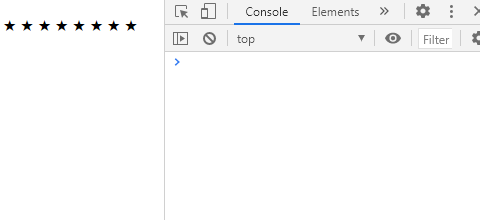
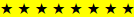
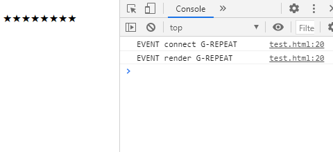
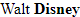

# UIFactory

UIFactory is a simple HTML component library.

- **It's small**. <1.5KB minified, gzipped.
- **Nothing new to learn**. No shadow DOM. No virtual DOM. Just regular HTML, CSS and JS.

## Installation

Using [npm](https://www.npmjs.com/get-npm):

```bash
npm install uifactory lodash
```

To include it in your script, use

```html
<script src="node_modules/lodash/lodash.min.js"></script>
<script src="node_modules/uifactory/uifactory.js"></script>
```

## Components are HTML elements

For example, you can create a `<g-repeat value="8">★</g-repeat>` that component that repeats the star (★) 8 times.


## ... defined as lodash templates

Any `<template component="x-xx">` defines a new `<x-xx>` element.

For example, this creates the `g-repeat` component we saw above:

```html
<template component="g-repeat" value="30">
  <% for (var j=0; j < +value; j++) { %>
    <%= this.innerHTML %>
  <% } %>
</template>
```

The `component="g-repeat"` attribute defines a `<g-repeat>` component. You **MUST** have a hypen in the component name.

Wherever `<g-repeat></g-repeat>` is placed, the [lodash template](https://lodash.com/docs/#template) is rendered inside it.

- `<%= ... %>` renders JavaScript code.
- `<% ... %>` runs JavaScript code without rendering.

So, `<g-repeat value="8">★</g-repeat>` renders:

.


## Access attributes as variables

Any attributes in your `<template>` is available as a variable in JavaScript. For example, `<template value="30">` in the example below becomes the JavaScript variable `value`:

```html
<template component="g-repeat" value="30">
  <% for (var j=0; j < +value; j++) { %>
    <%= this.innerHTML %>
  <% } %>
</template>
```

When using the component, e.g. `<g-repeat value="8"></g-repeat>`, `value` comes `"8"`.

If you add a component attribute, e.g. `<g-repeat color="red">`, *without* adding it to the template, you can't access `color` as a variable. (But you can access it via [`$target.getAttribute('color')`](#access-component-as-target).)

You can also get or set these as attributes as properties. For example:

```js
let el = document.querySelector('g-repeat')   // Find the first <g-repeat>
console.log(el.value)                         // Prints the value=".."
el.value = 10                                 // Changes value="..." and re-renders
```



Notes:

- All attributes on the `<template>` are converted to variables, *except* `component=`. It defines the component tag name
- Attribute names with hyphens are converted to *camelCase*. For example, `<template font-size="8">` converts to variable `fontSize`.
- Attributes become *string* variables. You need to convert it to a number using `+value`.
- When you change the attribute or property, the component is *re-rendered*.


## Access `<template>` as `this`

`this` points to the template element (e.g. `<template component="g-repeat">`). For example, you can access contents of your `<template>` via `this.innerHTML`.

- `this` is a copy of component template as a DOM element.
- `this.innerHTML` has whatever was in your template.
- `this.querySelectorAll('*')` and similar expressions can access parts of the template


## Access component as `$target`

`$target` points to the element you add (e.g. `<g-repeat>`). For example, this adds a click event listener to each `g-repeat` component.

```html
<template component="g-repeat" value="30">
  <% for (var j=0; j < +value; j++) { %>
    <%= this.innerHTML %>
  <% } %>
  <%
    $target.addEventListener('click', console.log)
  %>
</template>
```


You can access component attributes, e.g. `<g-repeat color="red">`, via `$target.getAttribute('color')`.

Remember: `this` is the `<template>`. `$target` is the component, e.g. `<g-repeat>`

<!-- TODO: Explain why once: true -->


## Style components

Use regular CSS to style the components. The `<template>` is rendered directly inside the component (not a shadow DOM). So you can style the contents directly.

For example, this adds a yellow background to `<g-repeat>` if it has `value="8"`:

```html
<template component="g-repeat" value="30">
  <style>
    g-repeat[value="8"] { background-color: yellow; }
  </style>
  <% for (var j=0; j < +value; j++) { %>
    <%= this.innerHTML %>
  <% } %>
</template>
```



UIFactory copies all `<style>`s and `<link rel="stylesheet">`s into the document's HEAD, and runs them only once (even if you use the component multiple times.)


## Add events

Use a `<script>` tag to add events or define your component's behavior. For example:

```html
<template component="g-repeat" value="30">
  <% for (var j=0; j < +value; j++) { %>
    <%= this.innerHTML %>
  <% } %>
  <script src="https://cdn.jsdelivr.net/npm/jquery@3.6.0/dist/jquery.min.js"></script>
  <script>
    $('body').on('click', 'g-repeat', console.log)
  </script>
</template>
```


This `<script>` will be executed *before the component is rendered*. So use [event delegation](https://davidwalsh.name/event-delegate), e.g. using [jQuery](https://api.jquery.com/on/) or [delegate](https://www.npmjs.com/package/delegate).

When a component is added, it fires a `connect` event. Use this to add listeners to the component itself.

When a component is redrawn, it fires a `render` event. Use this to add listeners to the component's children.

For example, this tracks every component's connect and render event.

```js
$('body').on('connect render', function (e) {
  console.log('EVENT', e.type, e.target.tagName)
})
```




## Register components

You can register components via JavaScript like this:

```js
uifactory.register({
  name: 'g-repeat',
  template: '<% for (var j=0; j<+value; j++) { %><%= this.innerHTML %><% } %>',
  options: [
    { name: "value", value: "30" }
  ]
})
```

`uifactory.register()` accepts an object with these keys:

- `name`: component name, e.g. `"g-repeat"`
- `template`: component contents as a [lodash template](#-defined-as-lodash-templates)
- `options`: OPTIONAL: a list of [attributes](#access-attributes-as-variables) as `{name, value}` objects
- `window`: OPTIONAL: the [Window](https://developer.mozilla.org/en-US/docs/Web/API/Window) on which to register the component. Used to define components on other windows or IFrames
- `compile`: OPTIONAL: the [template compiler](#use-any-compiler) function to use


## Load components

You can register components from a HTML file like this:

```js
fetch('mycomponent.html')
  .then(response => response.text())
  .then(html => uifactory.register({ name: 'my-component', template: html }))
```

You can directly register components from a JSON file by calling `uifactory.register(url)`. For example,

```js
uifactory.register('g-repeat.json`)
```

... fetches `g-repeat.json` and calls `uifactory.register(...contents of the JSON...)`.


## Use any compiler

Instead of [lodash templates](https://lodash.com/docs/#template), you can use any function to compile templates.

For example, the `g-name` component below uses [Handlebars](https://handlebarsjs.com/) templates to render the last name in bold:

```html
<g-name first="Walt" last="Disney">
<script src="https://cdn.jsdelivr.net/npm/handlebars@latest/dist/handlebars.js"></script>
<script>
uifactory.register({
  name: 'g-name',
  template: '{{ first }} <strong>{{ last }}</strong>',
  compile: Handlebars.compile
})
</script>
```



You can change [lodash template settings](https://lodash.com/docs/4.17.15#templateSettings) into
[Tornado-like templates](https://www.tornadoweb.org/en/stable/template.html) like this:


```html
<g-repeat2 value="8">★</g-repeat2>
<script>
uifactory.register({
  name: 'g-repeat2',
  template: '{{ this.innerHTML }}',
  compile: html => _.template(html, {
    escape: /{{-([\s\S]+?)}}/g,
    evaluate: //g,
    interpolate: /{{([\s\S]+?)}}/g
  })
})
</script>
```


`compile:` must be a function that accepts a string that returns a template function.
When rendering, the template function is called with the properties object
(e.g. `{first: "Walt", last: "Disney", this: ...}`).
Its return value is rendered inside the component.

For example, this is a "template" that replaces all words beginning with `$` by looking up the properties object:

```html
<g-name first="Walt" last="Disney">
<script>
uifactory.register({
  name: 'g-name',
  template: '$first <strong>$last</strong>',
  compile: function (html) {
    // Returns template function
    return function (obj) {
      // Replace $xxx with obj["xxx"] and return the template
      return html.replace(/\$([a-zA-Z0-9_]+)/g, function (match, key) {
        return obj[key] || '$' + key
      })
    }
  }
})
</script>
```


## Support

Tested in Chrome 74+, Firefox 66+, Edge 18+, and Safari 11+. IE is not supported.

You can raise issues and feature requests at <https://github.com/gramener/uifactory/issues>.
