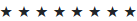
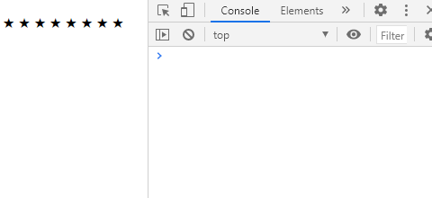
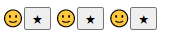
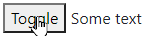
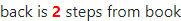
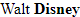

# UIFactory

UIFactory is a small, easy library that creates web components.

[Angular](https://angularjs.org/), [React](https://reactjs.org/), [Vue](https://vuejs.org/) and similar frameworks focus on building web applications.

**UIFactory builds re-usable web components**. These can be used in Angular, React, Vue, or even plain HTML.

- **It's small**. <4 KB compressed
- **It's compliant** with the [Web Components](https://developer.mozilla.org/en-US/docs/Web/Web_Components) standard. Works on all modern browsers
- **It's easy to learn**. Write any HTML, CSS and JS and wrap it in a `<template>` componentize it.

It's [MIT licensed](LICENSE).

## Tutorial

[UIFactory QuickStart](docs/quickstart/README.md) is a 15-minute tutorial that teaches how to build
a web component with UIFactory.

## Install from npm

Using [npm](https://www.npmjs.com/get-npm):

```bash
npm install uifactory
```

To include it in your script, use

```html
<script src="node_modules/uifactory/dist/uifactory.min.js"></script>
```

## Use pre-built components

UIFactory ships with these ready-to-use components:

- [`<comic-gen>`](docs/comic-gen.md) renders comic characters from data
- [`<md-text>`](docs/md-text.md) converts Markdown to HTML
- [`<svg-chart>`](docs/svg-chart.md) creates data-driven infographics from SVGs
- [`<vega-chart>`](docs/vega-chart.md) renders charts using Vega

## Components are HTML templates

For example, you can create a component like this:

```html
<repeat-html icon="★" value="8"></repeat-html>
```

... that repeats the star (★) 8 times, like this:



To create this `<repeat-html>` component, add a `<template $name="repeat-html">` like this:

```html
<template $name="repeat-html" icon="X" value="30">
  ${icon.repeat(+value)}
</template>
```

This uses [template literals](https://developer.mozilla.org/en-US/docs/Web/JavaScript/Reference/Template_literals)
inside the `<template>` to generate the HTML. Now,

```html
<repeat-html icon="★" value="8"></repeat-html>
```

... renders this output:


**NOTE**: You **MUST** have a dash (hyphen) in the component name (e.g. `repeat-html`).
[It's a standard](https://developer.mozilla.org/en-US/docs/Web/Web_Components/Using_custom_elements).


## Lodash templates are supported

For better control, you can use [Lodash templates](https://lodash.com/docs/#template) like this:

```html
<template $name="repeat-template" value="30" icon="★">
  <% for (var j=0; j < +value; j++) { %>
    <%= icon %>
  <% } %>
</template>
```

When you add the component to your page:

```html
<repeat-template value="8" icon="★"></repeat-template>
```

... it renders this output:

.

There are 3 kinds of template tags you can use:

1. **`<% ... %>` evaluates JavaScript**. e.g., `<% console.log('ok') %>` logs `ok`
2. **`<%= ... %>` renders JavaScript**. e.g., ``<%= `<b>${2 + 3}</b>` %>`` renders **5** in bold
3. **`<%- ... %>` renders JavaScript, HTML-escaped**. e.g., ``<%- `<b>${2 + 3}</b>` %>`` renders `<b>5</b>` in bold


## Use `<slot>`s in templates

Use [`<slot>`s in `<template>`s](https://developer.mozilla.org/en-US/docs/Web/Web_Components/Using_templates_and_slots)
to replace content. For example:

```html
<template $name="repeat-slots" a="1" b="1">
  <% for (var j=0; j < +a; j++) { %>
    <slot name="a">A</slot>
  <% } %>
  <% for (var j=0; j < +a; j++) { %>
    <slot name="b">B</slot>
  <% } %>
  <slot></slot>
</template>
```

When you add the component to your page:

```html
<repeat-slots a="5" b="5">
  <span slot="a">🔴</span>
  <span slot="b">🟩</span>
  <span slot="a"><strong>x</strong></span>
  <span slot="b"><em>y</em></span>
</repeat-slots>
```

... it renders this output:

🔴**x** 🔴**x** 🔴**x** 🔴**x** 🔴**x** 🟩*y* 🟩*y* 🟩*y* 🟩*y* 🟩*y* 🔴 🟩 **x** *y*

- `<slot name="a">` is replaced with all `slot="a"` elements (🔴 and **x**).
- `<slot name="b">` is replaced with all `slot="b"` elements (🟩 and *y*).
- `<slot>` is replaced with all elements in the component (🔴 🟩 **x** *y*). This is similar to the `.innerHTML`

See ["Using templates and slots" on MDN](https://developer.mozilla.org/en-US/docs/Web/Web_Components/Using_templates_and_slots)
for more.


## Wrap tables in HTML scripts

Some templates may lead to invalid HTML.

For example, HTML doesn't allow `<% for ... %>` inside a `<tbody>`. (Only `<tr>` is allowed.) So this is invalid:

```html
<template $name="table-invalid" rows="3">
  <table>
    <tbody>
      <% for (let i=0; i < +rows; i++) { %>
        <tr><td>Row <%= i %></td></tr>
      <% } %>
    </tbody>
  </table>
</template>
```

Instead, you should wrap your HTML inside a `<script type="text/html">...</script>`.
Anything you write inside it will be rendered as a template.
(Any HTML outside it is ignored.)

```html
<template $name="table-valid" rows="3">
  <script type="text/html">
    <table>
      <tbody>
        <% for (let i=0; i < +rows; i++) { %>
          <tr><td>Row <%= i %></td></tr>
        <% } %>
      </tbody>
    </table>
  </script>
  If you have a script type="text/html",
  any HTML outside it is ignored.
</template>
<table-valid rows="5"></table-valid>
```


## Define properties using `<template attr="...">`

Any attributes you add to `<template>` can be accessed via `element.attr`.
For example, `<template $name="repeat-html" icon="★" value="30">` defines properties
`.icon` and `.value`:

```html
<script>
let el = document.querySelector('repeat-html')  // Find first <repeat-html>
console.log(el.icon)                            // Prints the value of icon=""
console.log(el.value)                           // Prints the value of value=""
el.value = 10                                   // Re-render with value=10
</script>
```



Setting a property, e.g. `.value = ...` *re-renders* the component.
So does `.setAttribute('value', ...)`.

Notes:

- Attributes with uppercase letters (e.g. `fontSize`) are converted to lowercase properties (e.g. `fontsize`)
- Attributes with a dash/hyphen (e.g. `font-size`) are converted to *camelCase* properties (e.g. `fontSize`).
- Attributes not in the template are **NOT** properties, even if you add them in the component (e.g. `<my-component extra="x">` does not define a `.extra`).
- But [attributes with types (e.g. `extra:string="x"`) are available as properties](#add-properties-to-an-instance-using-types).


## Access properties as variables inside templates

Inside templates, properties are available as JavaScript variables.
For example, `<template value:number="30">` defines the variable `value` as a number with a default of 30:

```html
<template $name="repeat-value" value:number="30">
  <% for (var j=0; j < value; j++) { %>
    <slot></slot>
  <% } %>
</template>
<repeat-value value="8"></repeat-value>
```

Inside the template, the variable `value` has a value `8`.

Notes:

- If the attribute is a JavaScript keyword (e.g. `default=""`), you can't access it as a variable.
  Use `this.$data['default']` instead. [`this.$data` stories all properties](#thisdataproperty-stores-all-properties).


## Define property types using `<template attr:type="...">`

By default, properties are of type `string`. You can specify `number`, `boolean`, `array`,
`object` or `js` like this:

- `<template $name="..." num:number="30">` defines `.num` as a number `30`
- `<template $name="..." bool:boolean="true">` defines `.bool` as a boolean `true`
- `<template $name="..." arr:array="[3,4]">` defines `.arr` as an array `[3, 4]`
- `<template $name="..." obj:object="{x:1}">` defines `.obj` as an object `{x: 1}`
- `<template $name="..." expr:js="Math.ceil(2.2) + num">` defines `.expr` as a JS expression
  evaluating to `3 + num`.
    - You can use global variables like `Math.ceil`
    - You can use other properties like `num`
    - You can use use `data[property]` to access previously defined properties, like `data["num"]` or `data.num`

For example, when you add this to your page:

```html
<template $name="property-types" x="" str:string="" num:number="" bool:boolean=""
  arr:array="" obj:object="" expr:js="" rules:js="">
  <%= JSON.stringify({x, str, num, bool, arr, obj, expr, rules}) %>
</template>
<script>
  var rules = {r: 1}
</script>
<property-types x="x" str="y" num="30" bool="true" arr="[3,4]" obj="{x:1}"
  expr="Math.ceil(2.2) + num + data.num" rules="rules"></property-types>
```

... it renders this output:

```json
{"x":"x","str":"y","num":30,"bool":true,"arr":[3,4],"obj":{"x":1},"expr":63,"rules":{"r":1}}
```


## Update multiple properties with `.update()`

You can change multiple properties together using `.update({'attr-1': val, 'attr-2': val})`. For
example, this component has 2 properties, `char` and `repeat-value`:

```html
<template $name="repeat-props" char="★" repeat-value:number="10">
  ${char.repeat(repeatValue)}
</template>
<repeat-props char="★" repeat-value="10"></repeat-props>
```

When you add this script to your page:

```html
<script>
  document.querySelector('repeat-props').update({
    char: '⚡',
    'repeat-value': 8       // Note: use 'repeat-value', not repeatValue
  })
</script>
```

... updates both `char` and `repeat-value` to generate this output:


`.update()` also updates the attributes and re-renders the component. `.update()` takes a second dict with options:

- `attr: false` does not update the attribute. Default: `true`
- `render: false` does not re-render the component. Default: `true`

For example, this updates the properties without changing the attributes and without re-rendering.

```html
<script>
  document.querySelector('repeat-props').update({
    char: '⚽',
    'repeat-value': 5
  }, { attr: false, render: false })
</script>
```

To just re-render the component without changing properties, use `.update()`.

```html
<script>
  document.querySelector('repeat-props').update()
</script>
```


## Access component as `this` inside templates

Inside the [template](#lodash-templates-are-supported), `this` refers to the component itself.

For example, this component makes its parent's background yellow.

```html
<template $name="parent-background" color="yellow">
  <% this.parentElement.style.background = color %>
</template>
```

When you add the component to your page:

```html
<div>
  <parent-background></parent-background>
  This has a yellow background
</div>
```

... it renders this output:


This lets you control not just the component, but parents, siblings, and any other elements on a page.

## Access component contents as `this.$contents`

`this.$contents` is a cloned version of the custom element's original DOM. You can access what the
user specified inside your component and use it.

For example, `<repeat-icons>` repeats everything under `class="x"` x times, and everything under
`class="y"` y times.

```html
<template $name="repeat-icons" x:number="3" y:number="2">
  <%= this.$contents.querySelector('.x').innerHTML.repeat(x) %>
  <%= this.$contents.querySelector('.y').innerHTML.repeat(y) %>
</template>
```

```html
<repeat-icons x="5" y="4">
  <span class="x">🙂</span>
  <span class="y">😡</span>
</repeat-icons>
```

... it renders this output:

🙂🙂🙂🙂🙂😡😡😡😡


## Style components with CSS

Use regular CSS in the `<style>` tag to style components.

For example, this adds a yellow background to `<g-repeat>` if it has `value="8"`:

```html
<template $name="repeat-style" value:number="30">
  <style>
    repeat-style[value="8"] { background-color: yellow; }
  </style>
  <% for (var j=0; j < value; j++) { %>
    <slot></slot>
  <% } %>
</template>
```

When you add the component to your page:

```html
<repeat-style value="8">★</repeat-style>
```

... it renders this output:


## Link to external stylesheets

You can link to external stylesheets. For example, this imports Bootstrap 4.6.

```html
<template $name="bootstrap-button" type="primary">
  <link rel="stylesheet" href="https://cdn.jsdelivr.net/npm/bootstrap@4.6.0/dist/css/bootstrap.min.css">
  <button class="btn btn-<%= type %> m-3"><slot></slot></button>
</template>
```

When you add the component to your page:

```html
<bootstrap-button type="success">★</bootstrap-button>
```

... it renders this output:


All `<style>`s and `<link rel="stylesheet">`s are copied from the `<template>` and appended to the document's HEAD.
They run only once (even if you use the component multiple times.)


## Override styles normally

UIFactory just copies the HTML into the component. There's no shadow DOM. You can override a component styles normally.

For example, this `<style>` affects buttons inside the component:

```html
<style>
  /* When user hovers on any button inside a repeat-style, or a .lime button, color it lime */
  repeat-style button:hover, repeat-style button.lime {
    background-color: lime;
  }
</style>
<repeat-style value="5">
  🙂<button>★</button>
</repeat-style>
```

... it renders this output:




## Add behavior with JavaScript

Use regular JavaScript to add logic and interactivity.

```html
<template $name="text-diff" x="" y="">
  "${x}" is ${uifactory.textDiff.distance(x, y)} steps from "${y}"
  <script src="https://cdn.jsdelivr.net/npm/levenshtein@1.0.5/lib/levenshtein.js"></script>
  <script>
    // By convention, we add any JS related to a component under uifactory.<componentName>
    uifactory.textDiff = {
      distance: (x, y) => (new Levenshtein(x, y)).distance
    }
  </script>
</template>
```

When you add the component to your page:

```html
<text-diff x="back" y="book"></text-diff>
```

... it renders this output:

```text
"back" is 2 steps from "book"
```

All `<script>`s are copied from the `<template>` and appended to the document's BODY in order.
They run only once (even if you use the component multiple times.)

Rather than using global variables, we suggest you add methods to `uifactory.<componentName>` --
like `uifactory.textDiff = {...}` above.


## Use lifecycle events to render components using JavaScript

Components fire these events at different stages of their lifecycle:

- `preconnect`: when the instance is created, but no properties are defined yet
- `connect`: properties are defined, but external scripts may not be loaded
- `prerender`: external scripts are loaded, but template not yet rendered
- `render`: template is rendered
- `disconnect`: element is disconnected from the DOM

Add `<script onpreconnect>...</script>`, `<script onrender>...</script>`, etc to create listeners.
For example:

```html
<template $name="repeat-events" icon="★" value:number="1">
  <script onrender>
    /* globals e, icon, value */
    console.log(e.type)   // "e" is the custom event. Prints "render"
    // Listeners can use this (the component) and properties like in templates
    this.innerHTML = icon.repeat(value)
  </script>
</template>
```

Now, `<repeat-events icon="★" value="8"><repeat-events>` renders this output:


Notes:

- You can add a listener to multiple events, like `<script onprerender onrender>`
- You can add multiple listeners to an event, e.g. by repeating `<script onrender>...</script>`
- You can add listeners using `this.addEventListener('render', ...)` too
- You can use these variables in `<script onrender>`, etc:
  - [`this` is the component itself](#access-component-as-this-inside-templates)
  - [All properties are available as variables](#access-properties-as-variables-inside-templates)
  - `e` is the [custom event](https://developer.mozilla.org/en-US/docs/Web/API/CustomEvent/CustomEvent) fired by the component


## Add listeners using lifecycle events

The best place to add an event listener to your component is in `<script onrender>`.
For example, this component toggles text red when a button is pressed.

```html
<template $name="toggle-red">
  <style>
    toggle-red .red { color: red; }
  </style>
  <button>Toggle</button> <span>Some text</span>
  <script onrender>
    this.querySelector('button').addEventListener('click', e => {
      this.querySelector('span').classList.toggle('red')
    })
  </script>
</template>
```

When you add the component to your page:

```html
<toggle-red></toggle-red>
```

... it renders this output:




## Import components with `import="file.html"`

To re-use components across projects, save one or more component `<template>`s in a HTML file.
For example, `tag.html` could look like this:

```html
<template $name="tag-a">
  This is tag-a
</template>
<template $name="tag-b">
  This is tag-b
</template>
```

To import it in another file, use:

```html
<script src="node_modules/uifactory/dist/uifactory.min.js" import="tag.html"></script>
```

Now you can use all `<template $name="...">` components from `tag.html`. For example:

```html
<tag-a></tag-a>
<tag-b></tag-b>
```

This uses [fetch](https://developer.mozilla.org/en-US/docs/Web/API/Fetch_API/Using_Fetch),
the fetched files must be in the same domain, or
[CORS-enabled](https://developer.mozilla.org/en-US/docs/Web/HTTP/CORS).

You can import multiple component files separated by comma and/or spaces.

```html
<tag2-a></tag2-a>
<tag2-b></tag2-b>
<script src="node_modules/uifactory/dist/uifactory.min.js" import="tag.html, tag2.html"></script>
```

You can use relative and absolute paths, too. For example:

```html
<tag3-a></tag3-a>
<tag3-b></tag3-b>
<tag4-a></tag4-a>
<tag4-b></tag4-b>
<script src="node_modules/uifactory/dist/uifactory.min.js" import="
  ../test/tag3.html
  https://cdn.jsdelivr.net/npm/uifactory/test/tag4.html
"></script>
```

You can also import via JavaScript:

```html
<tag5-a></tag5-a>
<tag5-b></tag5-b>
<script>
uifactory.register('tag5.html')
</script>
```

## Import standard components with `import="@component-name"`

UIFactory has pre-defined HTML components that you can import, e.g. `<svg-chart>`. To import these,
use `import="@component-name"`.

You can import multiple component files separated by comma and/or spaces.

For example, this imports the `<svg-chart>` and `<md-text>` components:

```html
<script src="node_modules/uifactory/dist/uifactory.min.js" import="@svg-chart @md-text"></script>
```

This is the same as:

```html
<script src="node_modules/uifactory/dist/uifactory.min.js"
  import="
    node_modules/uifactory/src/svg-chart.html
    node_modules/uifactory/src/md-text.html
  "></script>
```

When you add the component to your page:

```html
<md-text>**Strong text** and *italics*</md-text>
```

... it renders this output:

**Strong text** and *italics*


## Fetch URLs as text using the `:urltext` type

To fetch a URL as text, specify `:urltext` as the property type. For example, this `<fetch-text>`
component displays "Loading..." until a URL is loaded, and then displays its text.

```html
<template $name="fetch-text" src:urltext="">
  <% if (src === null) { %>
    Loading...
  <% } else { %>
    <%= src %>
  <% } %>
</template>
<fetch-text src="page.txt"></fetch-text>
```

... it renders the contents of [page.txt](test/page.txt) as text:

```text
Contents of page.txt
```

This component will be **rendered twice** (and fire two `prerender`/`render` events.)

1. The first happens immediately, before loading the URL. `src` is `null`. This is useful to display a "Loading..." sign
2. The second happens after loading the URL. `src` now has the contents as text

To reload the URL and re-render, you can set `.src = 'page.pxt'` or `.update({src: 'page.txt'})`:

```js
document.querySelector('.fetch-text').src = 'page.txt'
// OR
document.querySelector('.fetch-text').update({ src: 'page.txt' })
```

You can set the property to another URL (which is fetched) or a non-string JS object (which is used as-is).
For example:

```js
document.querySelector('.fetch-text').src = 'page2.txt'   // Loads page2.txt, re-renders
document.querySelector('.fetch-text').src = null          // Sets src=null, re-renders
```

<!-- TODO: to set .src to a string, use .update({ src: 'result', { noparse: true } }) -->

## Fetch URLs as JSON using the `:urljson` type

To fetch a URL as JSON, specify `:urljson` as the property type. For example, this `<fetch-json>`
component displays "Loading..." until a URL is loaded, and then displays its JSON.

```html
<template $name="fetch-json" src:urljson="">
  <% if (src === null) { %>
    Loading...
  <% } else { %>
    <%= JSON.stringify(src) %>
  <% } %>
</template>
<fetch-url src="page.json"></fetch-url>
```

... it renders the contents of [page.json](test/page.json):

```text
{"text":"abc","number":10,"object":{"x":[1,2,3]}}
```

This component will be **rendered twice** (and fire two `prerender`/`render` events.)

1. The first happens immediately, before loading the URL. `src` is `null`. This is useful to display a "Loading..." sign
2. The second happens after loading the URL. `src` now has the contents as JSON

To reload the URL and re-render, you can set `.src = 'page.json'` or `.update({src: 'page.json'})`:

```js
document.querySelector('.fetch-json').src = 'page.json'
// OR
document.querySelector('.fetch-json').update({ src: 'page.json' })
```

You can set the property to another URL (which is fetched) or a non-string JS object (which is used as-is).
For example:

```js
document.querySelector('.fetch-json').src = 'page2.json'  // Loads page2.json, re-renders
document.querySelector('.fetch-json').src = {x: 1}        // Sets src={x:1}, re-renders
```


## Fetch URLs using the `:url` type

To fetch a URL as text, specify `:url` as the property type. For example, this `<fetch-page>`
component displays "Loading..." until a URL is loaded, and then displays it.

```html
<template $name="fetch-page" src:url="">
  <% if (src === null) { %>
    Loading...
  <% } else { %>
    <%= src.text %>
  <% } %>
</template>
<fetch-page src="page.txt"></fetch-page>
```

... it renders the contents of [page.txt](test/page.txt):

```text
Contents of page.txt
```

This component will be **rendered twice** (and fire two `prerender`/`render` events.)

1. The first happens immediately, before loading the URL. `src` is `null`. This is useful to display a "Loading..." sign
2. The second happens after loading the URL. `src` now has the contents as
   a [Response](https://developer.mozilla.org/en-US/docs/Web/API/Response) object with these keys:
   - `.headers`: response [headers](https://developer.mozilla.org/en-US/docs/Web/API/Response/headers)
   - `.status`: HTTP status code
   - `.statusText`: HTTP status message corresponding to the status code (e.g., OK for 200)
   - `.ok`: `true` if the HTTP status is the range 200-299
   - `.url`: The URL of the response -- after any redirections
   - `.text`: Text from the loaded page. This is **not a Promise**, but the actual text

-------------------------------------------------


# Advanced options

## Register component with options

To register a component with full control over the options, use:

```html
<repeat-options value="8"></repeat-options>
<script>
// NOTE: Add this AFTER the component is defined, not before. Else <slot> contents won't be defined
// See https://github.com/WICG/webcomponents/issues/551
uifactory.register({
  name: 'repeat-options',
  template: '<% for (var j=0; j<+value; j++) { %><slot></slot><% } %>',
  properties: {
    value: { value: "30", type: "number" }
  }
})
</script>
```

The object has these keys:

- `name`: component name, e.g. `"g-repeat"`
- `template`: component contents as a [template](#lodash-templates-are-supported)
- `properties`: OPTIONAL: mapping of [properties](#define-property-types-as-json) as `name: {value, type}` property definitions
- `window`: OPTIONAL: the [Window](https://developer.mozilla.org/en-US/docs/Web/API/Window) on which to register the component. Used to define components on other windows or IFrames
- `compile`: OPTIONAL: the [template compiler](#use-any-compiler) function to use


## `this.$data[property]` stores all properties

All properties are stored in `this.$data` as an object. You can read and write these values.
For example, this `<print-default>` component changes the default attribute before rendering:

```html
<template $name="print-default" default="old">
  <script onprerender>
    console.log(this.$data)     // Prints { "default": "old" }
    this.$data.default = 'new'  // Updates default value
  </script>
  <%= this.$data.default %>
</template>
```

Normally, properties are ALSO accessible as `this.<attributeName>`.
But if you define a `<template query-selector="xx">`, will `this.querySelector` be "xx" or the
[this.querySelector()](https://developer.mozilla.org/en-US/docs/Web/API/Element/querySelector) function?

ANS: `this.querySelector` is the function. `this.$data.querySelector` holds "xx".

This is be useful if you don't know whether a property is defined or not.
For example, when you add this to your page:

```html
<template $name="obj-values" x:number="0" y:number="0">
  Properties:
    <% for (let key in this.$data) { %>
      <%= key %>=<%= this.$data[key] %>
    <% } %>
  z=<%= 'z' in this.$data ? 'defined' : 'undefined' %>
</template>
<obj-values x="10" y="20"></obj-values>
```

... it renders this output:

`Properties: x=10 y=20 z=undefined`


## Create components dynamically

You can dynamically add components at any time. For example:

```html
<div id="parent1"></div>
<script>
  document.querySelector('#parent1').innerHTML = '<repeat-html icon="★" value="8"><repeat-html>'
</script>
```

... adds `<repeat-html icon="★" value="8"><repeat-html>` to the body.


This code does the same thing:

```html
<div id="parent2"></div>
<script>
  let el = document.createElement('repeat-html')
  el.setAttribute('icon', '★')
  el.setAttribute('value', '8')
  document.querySelector('#parent2').appendChild(el)
</script>
```


## Add properties to an instance using types

You can [defining properties on templates](#define-properties-using-template-attr). But you can
add properties on an instance too.

For example, if you have a `<base-component>` with a `base` or `root` attributes like this:

```html
<template $name="base-component" base:number="10" root="">
  Instance properties:
  <% for (let key in this.$data) { %>
    <%= key %>=<%= this.$data[key] %>
  <% } %>
</template>
```

... you can add a custom property when creating the element, by adding a type (e.g. `:number`) like this:

```html
<base-component child:number="20"></base-component>
```

This will render:

```text
Instance properties: base=10 root= child=20
```

The `child` JavaScript variable is now available (as a number).

You can update instance property `.child=...` or the attribute `child:number=`

```html
<script>
  document.querySelector('base-component').child = 30   // Redraw with child=30
  document.querySelector('base-component').setAttribute('child:number', '40')
</script>
```

The instance types **override** the template. For example, here, `base` and `root` are defined as
`:js`, which overrides the template's `base:number`:

```html
<base-component child:number="20" base:js="1 + 2" root:js="2 + 3"></base-component>
```

This will render:

```text
Instance properties: base=3 src=5 child=20
```

## Add custom types

We define property types on attributes like this: `attr:type="value"`. The default types are
`string` (default), `number`, `boolean`, `array`, `object` or `js`.

You can add a new custom type by extending `uifactory.types`. For example:

```js
uifactory.types.newtype = {
  parse: string => ...,         // Function to convert string to value
  stringify: value => ...       // Function to convert value to string
}
```

Let's add type called `:range`, which creates an array of values:

```js
uifactory.types.range = {
  // Parse a string like seq:range="0,10,2" into [0, 2, 4, 6, 8]
  parse: string => {
    // Pick start, step, end as the first 3 numbers in the string
    let [start, end, step] = string.split(/\D+/)
    // Convert it into an array
    let result = []
    for (let val = (+start || 0); val < (+end || 1); val += (+step || 1))
      result.push(val)
    return result
  },
  // Stringify an array like [0, 2, 4, 6, 8] into "0,10,2"
  stringify: value => {
    let start = value[0]                      // First value, e.g. 0
    let step = value[1] - value[0]            // 2nd - 1st value, e.g. 2
    let end = value[value.length - 1] + step  // Last value + step, e.g. 8 + 2 = 10
    return `${start},${end},${step}`
  }
}
```

When you add a component using this custom type to your page:

```html
<template $name="custom-range" series:range="">
  Values are <%= JSON.stringify(series) %>
</template>
<custom-range series="0,10,2"></custom-range>
```

... it renders this output:

`Values are [0,2,4,6,8]`


## Custom types need a parse and stringify function

Each [custom type](#add-custom-types) you add to `uifactory.types` needs a `parse` and `stringify`
functions with the following signature:

- `parse(string, name, data)`: Converts the attribute `name:type="string"` into the property `el.$data.name`
  - `string`: string value of the attribute
  - `name`: name of the attribute. (Property names are in camelCase. This is in kebab-case)
  - `data`: all properties of the component, computed so far
- `stringify(value, name, data)`: Converts the property `el.$data.name == value` into a attribute value string
  - `value`: JavaScript object holding the property value
  - `name`: name of the attribute. (Property names are in camelCase. This is in kebab-case)
  - `data`: all properties of the component, computed so far

It can be quite useful to have all properties available as `data`. This lets you parse attributes
based on previous attributes.

For example, let's create a `:formula` type that executes JavaScript. For example:

```js
uifactory.types.formula = {
  // Compile string into a JavaScript function, call it with data, return the result
  parse: (string, name, data) => {
    let fn = new Function('data', `with (data) { return (${string}) }`)
    return fn(data)
  },
  // Just convert the value into a JSON string
  stringify: value => JSON.stringify(value)
}
```

When you add a component using this custom type to your page:

```html
<template $name="custom-formula" x:number="0">
  x=<%= x %>, y=<%= y %>, z=<%= z %>
</template>
<custom-formula x="10" y:formula="x * x" z:formula="2 * y + x"></custom-formula>
```

... it renders this output:

`x=10, y=100, z=210`

The `:formula` type evaluates values in the context of previous values.


## Check if ready with `.$ready`

You can check if a component is ready (i.e. rendered for the first time), using the
`.$ready` Promise. For example, this component uses an external script. It may time to
get read.

```html
<template $name="text-diff2" x="" y="">
  ${x} is <strong>${uifactory.textDiff2.distance(x, y)} steps</strong> from ${y}
  <script src="https://cdn.jsdelivr.net/npm/levenshtein@1.0.5/lib/levenshtein.js"></script>
  <script>
    // By convention, we add any JS related to a component under uifactory.<componentName>
    uifactory.textDiff2 = {
      distance: (x, y) => (new Levenshtein(x, y)).distance
    }
  </script>
</template>

<text-diff2 x="back" y="book"></text-diff>
```

When check if it has been ready, use:

```js
  let el = await document.querySelector('text-diff2').$ready
  // The <strong> child will be present only after the component is ready.
  el.querySelector('strong').style.color = 'red'
```

It turns the `<strong>` element red when it's ready:




## Get registered components from `uifactory.components`

If you register a `<ui-config>` component, `uifactory.components['ui-config']` has the component's
configuration, i.e. its name, properties, template, and any other options used to register the
component.

For example, this component renders its own configuration.

```html
<template $name="ui-config" str="x" arr:array="[3,4]" expr:js="3 + 2">
  <%= JSON.stringify(uifactory.components['ui-config']) %>
</template>
```

When you add the component to your page:

```html
<ui-config></ui-config>
```

... it renders this output:

```json
{
  "name": "ui-config",
  "properties": {
    "str": {
      "type": "string",
      "value": "x"
    },
    "arr": {
      "type": "array",
      "value": "[3,4]"
    },
    "expr": {
      "type": "js",
      "value": "3 + 2"
    }
  },
  "template": "\n <%= JSON.stringify(uifactory.components['ui-config']) %>\n"
}
```


## Use any renderer

Gramex renders the generated HTML into a node by setting `node.innerHTML = html`.
This removes all existing DOM elements and creates new ones.

This is not good if you have event handlers, or want animations. For example, if you want to
rescale a chart's axis smoothly without re-drawing.

You can instead specify a custom `$render:js="myfunction"` where `myfunction(node, html)` updates
the `node` in any way.

For example, here's an SVG component that smoothly animates when an attribute changes:

<!-- TODO:
  - explain what the html in (node, html) is
  - OPTIONAL: can we have the past node.$data state?
  - ROADMAP: use nanomorph / morphdom via $render="morphdom"
-->

```html
<template $name="move-circle" x="0" $render:js="uifactory.moveCircle">
  <svg width="400" height="100" fill="#eee">
    <circle cx="<%= x %>" cy="50" r="30" fill="red"></circle>
  </svg>
  <style>
    move-circle circle {
      transition: all 0.5s ease;
    }
  </style>
  <script>
    // Define a moveCircle function that accepts node as the first parameter.
    // It's called whenever the component is created or updated
    uifactory.moveCircle = function (node, html) {
      let circle = node.querySelector('circle')
      // The first time, it has no child circle. So set the HTML
      if (!circle)
        node.innerHTML = html
      // After that, don't redraw. Update the circle
      else
        node.querySelector('circle').setAttribute('cx', node.$data.x)
    }
  </script>
</template>
<move-circle x="100"></move-circle>
```

Now, suppose you change the circle's color programmatically and then change the `x=""` attribute:

```html
<script>
  document.querySelector('move-circle circle').setAttribute('fill', 'blue')
  document.querySelector('move-circle circle').setAttribute('x', '200')
</script>
```

... the circle is not redrawn. It stays blue. It smoothly moves to `x="200"`.


## Use any compiler

Instead of [templates](#lodash-templates-are-supported), you can use any function to compile templates.

For example, the `g-name` component below uses [Handlebars](https://handlebarsjs.com/) templates to render the last name in bold:

```html
<g-name first="Walt" last="Disney">
<script src="https://cdn.jsdelivr.net/npm/handlebars@latest/dist/handlebars.js"></script>
<script>
uifactory.register({
  name: 'g-name',
  template: '{{ first }} <strong>{{ last }}</strong>',
  compile: Handlebars.compile
})
</script>
```



`compile:` must be a function that accepts a string that returns a template function.
When rendering, the template function is called with the properties object
(e.g. `{first: "Walt", last: "Disney", this: ...}`).
Its return value is rendered inside the component.

For example, this is a "template" that replaces all words beginning with `$` by looking up the properties object:

```html
<g-name first="Walt" last="Disney">
<script>
uifactory.register({
  name: 'g-name',
  template: '$first <strong>$last</strong>',
  compile: function (html) {
    // Returns template function
    return function (obj) {
      // Replace $xxx with obj["xxx"] and return the template
      return html.replace(/\$([a-zA-Z0-9_]+)/g, function (match, key) {
        return obj[key] || '$' + key
      })
    }
  }
})
</script>
```


## Release

To release a new version:

- In `README.md`, update the [Change log](#change-log)
- Update `version` in all files and examples, and mainly in [package.json](package.json)

Then run:

```bash
git commit . -m"BLD: Release x.x.x"
git push
npm publish
```

## Change log

- 1.18.0 (19 Sep 2021):
  - Major API rewrite. See [migration to v1](docs/migration-v1.md)
  - [Lifecycle events](#use-lifecycle-events-to-render-components-using-javascript)
- 0.0.17 (18 Sep 2021): Remove lodash dependency
- 0.0.16 (1 Sep 2021):
  - `<style scoped>` applies style only to component
  - `el.property = value` re-renders `el`
  - `el.update({'attr:type': ...})` supported
  - `<vega-chart>` component added with signals support
- 0.0.15 (11 Aug 2021): `@render:js` attribute supports [custom renderers](#use-any-renderer)
- 0.0.14 (30 Jun 2021): `<comic-gen>` component added
- 0.0.13 (29 Jun 2021): Minify code into `dist/uifactory.min.js`
- 0.0.12 (25 Jun 2021): [`<slot>` support](#use-slots-in-templates)
- 0.0.11 (17 Jun 2021): [`:urljson`](#fetch-urls-as-json-using-the-urljson-type) and
  [`:urltext`](#fetch-urls-as-text-using-the-urltext-type) types added.
  [`"import=@component-name"` support](#import-standard-components-with-importcomponent-name)
- 0.0.10 (9 Jun 2021): `<svg-chart>` component added. `:js` allows properties as variables
- 0.0.9 (2 Jun 2021): The `:url` attribute type [fetches data from a URL](#fetch-urls-using-the-url-type)
- 0.0.8 (27 May 2021): Custom types' `.parse()` receives `this.data` as input
- 0.0.7 (26 May 2021): Allow [custom types](#custom-types-need-a-parse-and-stringify-function)
- 0.0.6 (21 Apr 2021): Allow [property type definitions](#define-properties-using-template-attr)

## Support

Tested in Chrome, Firefox, Edge, and Safari. IE is not supported.

You can raise issues and feature requests at <https://github.com/gramener/uifactory/issues>.
