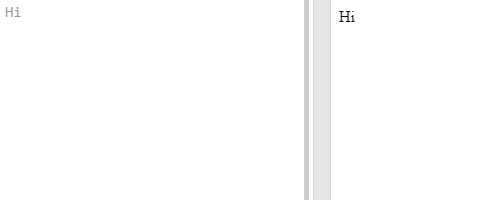

# UIFactory

<!-- markdownlint-disable no-inline-html -->
<!-- Generate Favicon from image using https://favicon.io/favicon-generator/ -->

[UIFactory](https://uifactory.gramener.com/) is a small, elegant web component framework.

**UIFactory builds re-usable web components**. These can be used with plain HTML, Angular, React, Vue, or any other web application framework.

- **It's small**. <4 KB compressed
- **It's compliant** with the Web Components standard. Works on all modern browsers
- **It's easy to learn**. Write any HTML, CSS and JS and wrap it in a `<template>` componentize it.
- **No compilation**. No server. No hosting. Just save in a HTML file.

## Learn

- [**Quickstart tutorial**](https://uifactory.gramener.com/quickstart/): Just 15 min
- [**Feature guide**](https://uifactory.gramener.com/guide/): Covers everything

## Use pre-built components

UIFactory ships with these ready-to-use components:

- [`<comic-gen>`](https://uifactory.gramener.com/comic-gen/) renders comic characters from data
- [`<md-text>`](https://uifactory.gramener.com/md-text/) converts Markdown to HTML
- [`<network-chart>`](https://uifactory.gramener.com/network-chart/) renders network graphs
- [`<svg-chart>`](https://uifactory.gramener.com/svg-chart/) creates data-driven infographics from SVGs
- [`<vega-chart>`](https://uifactory.gramener.com/vega-chart/) renders charts using Vega

## Contributing

Please read the [Contributing Guide](https://github.com/gramener/uifactory/tree/master/CONTRIBUTING.md) for how you could contribute.

## Releases

[See all UIFactory releases](https://github.com/gramener/uifactory/releases)

## License

Copyright © Gramener.

Licensed under the [MIT license](https://github.com/gramener/uifactory/tree/master/LICENSE).

## Support

UIFactory is tested in Chrome, Firefox, Edge, and Safari. IE is not supported.

Please raise issues and feature requests at <https://github.com/gramener/uifactory/issues>.
