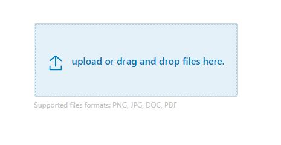

# bs5-upload

<!-- TODO: Chandana to write the bs5-upload docs using the same structure -->

`<bs5-upload>` renders an input field element to upload or drag and drop files to it.

This is useful for:

- Uploading Files
- drag and drop files.
- Selection of files from file explorer.
- Multiple files upload option
- Shows files which are uploaded with the delete option.

taken a reference from Bootstrap5 (https://getbootstrap.com/docs/5.1/forms/form-control/#file-input)

## Usage

Add this code anywhere in your HTML page:

```html
<script src="https://cdn.jsdelivr.net/npm/lodash/lodash.min.js"></script>
<script src="https://cdn.jsdelivr.net/npm/uifactory@0.0.16/dist/uifactory.min.js" import="@bs5-upload"></script>

<bs5-upload title=""></bs5-upload>

-- field disabled
<bs5-upload title="" disabled></bs5-upload>

```

This renders the following output:



## Properties

`<bs5-upload>` has title and disabled propertie:

-- title - which defines the label or heading of file input field.
-- Adding disabled attribite to an element makes input field disable 
