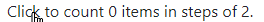

# UIFactory Guide

## Install

You can use UIFactory directly from the CDN:

```html
<script src="https://cdn.jsdelivr.net/npm/uifactory@1.21.0/dist/uifactory.min.js"></script>
```

Or you can use [npm](https://www.npmjs.com/get-npm) to install UIFactory locally:

```bash
npm install uifactory
```

... and include it in your HTML file with:

```html
<script src="node_modules/uifactory/dist/uifactory.min.js"></script>
```

## Components are HTML templates

To create this `<repeat-html>` component, add a `<template $name="repeat-html">` like this:

```html
<template $name="repeat-html" icon="X" value="30">
  ${icon.repeat(+value)}
</template>
```

When you add the component to your page:

```html
<repeat-html icon="★" value="8"></repeat-html>
```

... it renders this output:


This uses [template literals](https://developer.mozilla.org/en-US/docs/Web/JavaScript/Reference/Template_literals)
inside the `<template>` to generate the HTML.

NOTE:

- You **MUST** have a dash (hyphen) in the component name (e.g. `repeat-html`).
  [It's a standard](https://developer.mozilla.org/en-US/docs/Web/Web_Components/Using_custom_elements).


## Load components from HTML files

You can save components in a HTML file.
For example, this `tag.html` defines 2 components: `<tag-a>` and `<tag-b>`.

```html
<template $name="tag-a">This is tag-a</template>
<template $name="tag-b">This is tag-b</template>
```

To use `<tag-a>` and `<tag-b>` in your HTML file, import it with `import=`:

```html
<script src="//cdn.jsdelivr.net/npm/uifactory" import="tag.html"></script>
```
Load multiple files separated by comma and/or spaces. Relative and absolute URLs both work.

```html
<script src="//cdn.jsdelivr.net/npm/uifactory" import="
  tag.html, tag2.html, ../test/tag3.html
  https://cdn.jsdelivr.net/npm/uifactory/test/tag4.html
"></script>
```

To import [pre-built components](#use-pre-built-components), use `import="@component-name"`:

```html
<script src="//cdn.jsdelivr.net/npm/uifactory" import="@svg-chart @md-text"></script>
```

Or, if you already loaded UIFactory, use:

```html
<script>
uifactory.register('tag5.html')
</script>
```

Note:

- This uses [fetch](https://developer.mozilla.org/en-US/docs/Web/API/Fetch_API/Using_Fetch).
The fetched files must be in the same domain or
[CORS-enabled](https://developer.mozilla.org/en-US/docs/Web/HTTP/CORS).


## Lodash templates are supported

For better control, you can use [Lodash templates](https://lodash.com/docs/#template) like this:

```html
<template $name="repeat-template" value="30" icon="★">
  <% for (var j=0; j < +value; j++) { %>
    <%= icon %>
  <% } %>
</template>
```

When you add the component to your page:

```html
<repeat-template value="8" icon="★"></repeat-template>
```

... it renders this output:

.

There are 3 kinds of template tags you can use:

1. **`<% ... %>` evaluates JavaScript**. e.g., `<% console.log('ok') %>` logs `ok`
2. **`<%= ... %>` renders JavaScript**. e.g., ``<%= `<b>${2 + 3}</b>` %>`` renders **5** in bold
3. **`<%- ... %>` renders JavaScript, HTML-escaped**. e.g., ``<%- `<b>${2 + 3}</b>` %>`` renders `<b>5</b>` instead of a bold **5**


## Define properties using `<template attr="...">`

Attributes added to `<template>` can be accessed as properties.
For example, this defines 2 attributes, `icon=` and `value=`:

```html
<template $name="repeat-icon" icon="★" value="30">
  ${icon.repeat(+value)}
</template>
```

Now, you can use `el.icon` and `el.value` to get and set these attributes.

```html
<script>
let el = document.querySelector('repeat-icon')  // Find first <repeat-icon>
console.log(el.icon)                            // Logs ★
console.log(el.value)                           // Logs 30
el.value = 10                                   // Renders ★★★★★★★★★
</script>
```


Setting a property, e.g. `.value = ...` *re-renders* the component.
So does `.setAttribute('value', ...)`.

NOTE:

- Attributes with uppercase letters (e.g. `fontSize`) are converted to lowercase properties (e.g. `fontsize`)
- Attributes with a dash/hyphen (e.g. `font-size`) are converted to *camelCase* properties (e.g. `fontSize`).
- Attributes not in the template are **NOT** properties, even if you add them in the component (e.g. `<my-component extra="x">` does not define a `.extra`).
- But [attributes with types (e.g. `extra:string="x"`) are available as properties](#add-properties-to-an-instance-using-types).


## Access properties as variables inside templates

Inside templates, properties are available as JavaScript variables.
For example, `<template value:number="30">` defines the variable `value` as a number with a default of 30:

```html
<template $name="repeat-value" value:number="30">
  <% for (var j=0; j < value; j++) { %>
    <slot></slot>
  <% } %>
</template>
<repeat-value value="8"></repeat-value>
```

Inside the template, the variable `value` has a value `8`.

NOTE:

- If the attribute is a JavaScript keyword (e.g. `default=""`), you can't access it as a variable.
  Use `this.$data['default']` instead. [`this.$data` stories all properties](#thisdataproperty-stores-all-properties).


## Define property types using `<template attr:type="...">`

By default, properties are of type `string`. You can specify `number`, `boolean`, `array`,
`object` or `js` like this:

- `<template $name="..." num:number="30">`
- `<template $name="..." bool:boolean="true">`
- `<template $name="..." arr:array="[3,4]">`
- `<template $name="..." obj:object="{x:1}">`
- `<template $name="..." expr:js="Math.ceil(2.2) + num">`

The value for `:js=` can include global variables as well as other properties defined just before this property.

For example, when you add this to your page:

```html
<template $name="property-types" x="" str:string="" num:number="" bool:boolean=""
  arr:array="" obj:object="" expr:js="" rules:js="">
  <%= JSON.stringify({x, str, num, bool, arr, obj, expr, rules}) %>
</template>
<script>
  var rules = {r: 1}
</script>
<property-types x="x" str="y" num="30" bool="true" arr="[3,4]" obj="{x:1}"
  expr="Math.ceil(2.2) + num + data.num" rules="rules"></property-types>
```

... it renders this output:

```json
{"x":"x","str":"y","num":30,"bool":true,"arr":[3,4],"obj":{"x":1},"expr":63,"rules":{"r":1}}
```


## Add dynamic classes and styles with `:=`

For dynamic classes, set the `class:=` attribute to a array, object, or string:

- `class:="['x', 'y']"` becomes `class="x y"`
- `class:="{x: true, y: false}"` becomes `class="x"`
- `class:="['x', {y: true, z: false}]"` becomes `class="x y"`
- `class:="${active ? 'yes' : 'no'}"` becomes `class="yes"` is active is true, else `class="no"`

For dynamic styles, set the `style:=` attribute to an object or string:

- ``style:="{'font-size': `${size}px`, color: 'red'}"`` becomes `style="font-size:20px;color:red"` (when size=20).
- `style:="font-size="${size}px; color: red"` also becomes `style="font-size:20px;color:red"` (when size=20).

For dynamic attributes, set the `<attr>:=` attribute to any string or boolean expression:

- `disabled:="true"` becomes "disabled"
- `disabled:="false"` does not add the disabled attribute
- `type:="isNumeric ? 'number' : 'text'"` sets `type="number"` if isNumeric is truthy, else `type="text"`

For example, this defines an `<add-class>` component:

```html
<template $name="custom-input" active:boolean="true">
  <style>
    .round { border-radius: 20px; }
    .active { border: 1px solid red; }
  </style>
  <input
    class:="['round', {active: active}]"
    style:="{background-color: active ? 'lightblue' : 'white'}"
    disabled:="!active">
</template>
```

When you add this to your page:

```html
Active: <custom-input active="true"></custom-input>
Inactive: <custom-input active="false"></custom-input>
```

... it renders:


## Use `<slot>` in templates

[Slots](https://developer.mozilla.org/en-US/docs/Web/Web_Components/Using_templates_and_slots)
let you create components in which component users can change content.

For example, this defines a component with 2 slots:

```html
<template $name="slot-translate">
   Good = <slot name="good">...</slot>.
   Bad = <slot name="bad">...</slot>.
</template>
```

When you add the component to your page:

```html
<slot-translate>
  <span slot="good"><em>bon</em></span>
  <span slot="bad"><strong>mauvais</strong></span>
</slot-translate>
```

... it renders this output:

Good = *bon*. Bad = **mauvais**.

- `<slot name="good">` is replaced with all `slot="good"` elements.
- `<slot name="bad">` is replaced with all `slot="bad"` elements.
- `<slot>` (without `name=`) is replaced with the whole `<slot-translate>` contents.

Slots can [contain variables](#lodash-templates-are-supported) like `${x}` or `<%= this %>`. This
lets component users customize the component further.


## Add re-usable blocks with `<script type="text/html" $block="...">`

To re-use HTML later, add it into a `<script type="text/html" $block="blockname">...</script>`. For example:

```html
<template $name="block-example" greeting="hello">
  <script type="text/html" $block="one">one says ${greeting}.</script>
  <script type="text/html" $block="two">two says ${greeting}.</script>

  <%= one() %>
  <%= two({ greeting: 'Ola' }) %>
</template>
```

When you add the component to your page:

```html
<block-example></block-example>
```

... it renders this output:

```text
one says hello. two says Ola.
```

Note:

- You can use [`this`](#access-component-as-this-inside-templates) and
  [all properties](#access-properties-as-variables-inside-templates) as variables.
- If multiple `<script type="text/html">` have the same `$block` value, the last one is used


## Update multiple properties with `.update()`

You can change multiple properties together using `.update({'attr-1': val, 'attr-2': val})`. For
example, this component has 2 properties, `char` and `repeat-value`:

```html
<template $name="repeat-props" char="★" repeat-value:number="10">
  ${char.repeat(repeatValue)}
</template>
<repeat-props char="★" repeat-value="10"></repeat-props>
```

After the element is rendered, run this code in your **JavaScript console**:

```js
document.querySelector('repeat-props').update({
  char: '⚡',
  'repeat-value': 8       // Note: use 'repeat-value', not repeatValue
})
```

This updates both `char` and `repeat-value` to generate this output:


`.update()` also updates the attributes and re-renders the component. `.update()` takes a second dict with options:

- `attr: false` does not update the attribute. Default: `true`
- `render: false` does not re-render the component. Default: `true`

For example, this updates the properties without changing the attributes and without re-rendering.

```js
document.querySelector('repeat-props').update({
  char: '⚽',
  'repeat-value': 5
}, { attr: false, render: false })
```

To re-render the component without changing properties, use `.update()`.

```js
document.querySelector('repeat-props').update()
```


## Access component as `this` inside templates

Inside the [template](#lodash-templates-are-supported), `this` refers to the component itself.

For example, this component makes its parent's background yellow.

```html
<template $name="parent-background" color="yellow">
  <% this.parentElement.style.background = color %>
</template>
```

When you add the component to your page:

```html
<div>
  <parent-background></parent-background>
  This has a yellow background
</div>
```

... it renders this output:


This lets you control not just the component, but parents, siblings, and any other elements on a page.


## `this.$id` hold a unique ID for each component

If you generate an `id=` attribute in your component, you need a unique identifier for each
component. `this.$id` has a string that's unique for each component instance.

For example, this creates a label-input combination with a unique ID for each input:

```html
<template $name="label-input" type="text" label="">
  <div style="display: flex; gap: 10px">
    <label for="${this.$id}-input">${label} <small>ID: ${this.$id}-input</small></label>
    <input id="${this.$id}-input" type="${type}">
  </div>
</template>
```

Now, if you repeatedly use this component in a page:

```html
<label-input label="X"></label-input>
<label-input label="Y"></label-input>
```

... it creates elements with different IDs:


## Style components with CSS

Use regular CSS in the `<style>` tag to style components. For example:

```html
<template $name="repeat-style" value:number="30">
  <style>
    /* If class="highlight", add a yellow background */
    repeat-style.highlight { background-color: yellow; }
    /* Color all bold items green INSIDE THE COMPONENT */
    b { color: green; }
  </style>
  <% for (var j=0; j < value; j++) { %>
    <slot></slot>
  <% } %>
</template>
```

When you add the component to your page:

```html
<repeat-style class="highlight" value="8">
  <b>★</b>
</repeat-style>
```

... it renders this output:


**You can't pollute styles outside the component**. UIFactory adds the component name before every
selector (if it's missing). For example:

- `repeat-style.highlight {...}` stays as-is -- it already has `repeat-style`
- `.highlight b {...}` becomes `repeat-style .highlight b {...}`
- `b { color: green}` becomes `repeat-style b { color:green; }`

So any `<b>` outside the component does not change color.

**Note**: This isn't foolproof. It's simply to prevent accidental pollution.

**You can override component styles from the outside**. UIFactory just copies the `<style>` into the
document -- no shadow DOM. Adding this `<style>` overrides the component color:

```html
<style>
/* Prefixing `body` to `repeat-stye b` for more specificity */
body repeat-style b { color: red; }
</style>
```


## Link to external stylesheets

You can link to external stylesheets. For example, this imports Bootstrap 4.6.

```html
<template $name="bootstrap-button" type="primary">
  <link rel="stylesheet" href="https://cdn.jsdelivr.net/npm/bootstrap@4.6.0/dist/css/bootstrap.min.css">
  <button class="btn btn-<%= type %> m-3"><slot></slot></button>
</template>
```

When you add the component to your page:

```html
<bootstrap-button type="success">★</bootstrap-button>
```

... it renders this output:


All `<style>`s and `<link rel="stylesheet">`s are copied from the `<template>` and appended to the document's `<head>`.
They run only once (even if you use the component multiple times.)


## Add behavior with JavaScript

Use regular JavaScript to add logic and interactivity.

```html
<template $name="text-diff" x="" y="">
  "${x}" is ${uifactory.textDiff.distance(x, y)} steps from "${y}"
  <script src="https://cdn.jsdelivr.net/npm/levenshtein@1.0.5/lib/levenshtein.js"></script>
  <script>
    // By convention, we add any JS related to a component under uifactory.<componentName>
    uifactory.textDiff = {
      distance: (x, y) => (new Levenshtein(x, y)).distance
    }
  </script>
</template>
```

When you add the component to your page:

```html
<text-diff x="back" y="book"></text-diff>
```

... it renders this output:

```text
"back" is 2 steps from "book"
```

All `<script>`s are copied from the `<template>` and appended to the document's BODY in order.
They run only once (even if you use the component multiple times.)


## Add events with `<script $on...>`

To add an `click` event listener to your component, write the code inside a
`<script $onclick>...</script>`, like this:

```html
<template $name="count-items" count:number="0" step:number="2">
  Click to count ${count} items in steps of ${step}.
  <script $onclick>
    this.count += step
  </script>
</template>
```

When you add the component to your page:

```html
<count-items></count-items>
```

... it renders this output:



To add a `click` event listener **to a child**, use `<script $onclick="child-selector">...</script>`:

```html
<template $name="count-button" count:number="0" step:number="2">
  <button>Click here</button>
  <span>Count: ${count}</span>
  <script $onclick="button">
    this.count += step
  </script>
</template>
```

Now, `<count-button></count-button>` renders:


Listeners can use these variables:

- `e` is the [event object](https://developer.mozilla.org/en-US/docs/Web/API/Event)
- `this` is the [component instance](#access-component-as-this-inside-templates)
- [Any property](#access-properties-as-variables-inside-templates), e.g. `count`, `step`

To call the listener only once, add the `$once` attribute to `<script>`:

```html
<template $name="count-once" count:number="0" step:number="2">
  <button>Click here once</button>
  <span>Count: ${count}</span>
  <script $onclick="button" $once>
    this.count += step
  </script>
</template>
```

Now, `<count-once></count-once>` renders:


## Lifecycle events are supported

Components fire these events at different stages of their lifecycle:

- `preconnect`: before the instance is created and properties are defined
- `connect`: after the instance is created and properties are defined
- `prerender`: before the instance is rendered
- `render`: after the instance is rendered
- `disconnect`: after the element is disconnected from the DOM

Add `<script $onpreconnect>...</script>`, `<script $onrender>...</script>`, etc to create listeners.
For example:

```html
<template $name="repeat-events" icon="★" value:number="1">
  <script $onrender>
    this.innerHTML = icon.repeat(value)
  </script>
</template>
```

Now, `<repeat-events icon="★" value="8"><repeat-events>` renders this output:


NOTE:

- `<script $onrender $once>` creates a listener that runs only once
- `<script $onprerender $onrender>` runs the listener both on prerender **AND** render
- Multiple `<script $onrender>...</script>` creates multiple listeners
- `this.addEventListener('render', ...)` is exactly the same as `<script $onrender>`


## Fetch URLs as text using the `:urltext` type

To fetch a URL as text, specify `:urltext` as the property type. For example, this `<fetch-text>`
component displays "Loading..." until a URL is loaded, and then displays its text.

```html
<template $name="fetch-text" src:urltext="">
  <% if (src === null) { %>
    Loading...
  <% } else { %>
    <%= src %>
  <% } %>
</template>
<fetch-text src="page.txt"></fetch-text>
```

... it renders the contents of [page.txt](test/page.txt) as text:

```text
Contents of page.txt
```

This component will be **rendered twice** (and fire two `prerender`/`render` events.)

1. The first happens immediately, before loading the URL. `src` is `null`. This is useful to display a "Loading..." sign
2. The second happens after loading the URL. `src` now has the contents as text

To reload the URL and re-render, you can set `.src = 'page.pxt'` or `.update({src: 'page.txt'})`:

```js
document.querySelector('.fetch-text').src = 'page.txt'
// OR
document.querySelector('.fetch-text').update({ src: 'page.txt' })
```

You can set the property to another URL (which is fetched) or a non-string JS object (which is used as-is).
For example:

```js
document.querySelector('.fetch-text').src = 'page2.txt'   // Loads page2.txt, re-renders
document.querySelector('.fetch-text').src = null          // Sets src=null, re-renders
```

<!-- TODO: to set .src to a string, use .update({ src: 'result', { noparse: true } }) -->

## Fetch URLs as JSON using the `:urljson` type

To fetch a URL as JSON, specify `:urljson` as the property type. For example, this `<fetch-json>`
component displays "Loading..." until a URL is loaded, and then displays its JSON.

```html
<template $name="fetch-json" src:urljson="">
  <% if (src === null) { %>
    Loading...
  <% } else { %>
    <%= JSON.stringify(src) %>
  <% } %>
</template>
<fetch-url src="page.json"></fetch-url>
```

... it renders the contents of [page.json](test/page.json):

```text
{"text":"abc","number":10,"object":{"x":[1,2,3]}}
```

This component will be **rendered twice** (and fire two `prerender`/`render` events.)

1. The first happens immediately, before loading the URL. `src` is `null`. This is useful to display a "Loading..." sign
2. The second happens after loading the URL. `src` now has the contents as JSON

To reload the URL and re-render, you can set `.src = 'page.json'` or `.update({src: 'page.json'})`:

```js
document.querySelector('.fetch-json').src = 'page.json'
// OR
document.querySelector('.fetch-json').update({ src: 'page.json' })
```

You can set the property to another URL (which is fetched) or a non-string JS object (which is used as-is).
For example:

```js
document.querySelector('.fetch-json').src = 'page2.json'  // Loads page2.json, re-renders
document.querySelector('.fetch-json').src = {x: 1}        // Sets src={x:1}, re-renders
```


## Fetch URLs using the `:url` type

To fetch a URL as text, specify `:url` as the property type. For example, this `<fetch-page>`
component displays "Loading..." until a URL is loaded, and then displays it.

```html
<template $name="fetch-page" src:url="">
  <% if (src === null) { %>
    Loading...
  <% } else { %>
    <%= src.text %>
  <% } %>
</template>
<fetch-page src="page.txt"></fetch-page>
```

... it renders the contents of [page.txt](test/page.txt):

```text
Contents of page.txt
```

This component will be **rendered twice** (and fire two `prerender`/`render` events.)

1. The first happens immediately, before loading the URL. `src` is `null`. This is useful to display a "Loading..." sign
2. The second happens after loading the URL. `src` now has the contents as
   a [Response](https://developer.mozilla.org/en-US/docs/Web/API/Response) object with these keys:
   - `.headers`: response [headers](https://developer.mozilla.org/en-US/docs/Web/API/Response/headers)
   - `.status`: HTTP status code
   - `.statusText`: HTTP status message corresponding to the status code (e.g., OK for 200)
   - `.ok`: `true` if the HTTP status is the range 200-299
   - `.url`: The URL of the response -- after any redirections
   - `.text`: Text from the loaded page. This is **not a Promise**, but the actual text

-------------------------------------------------


# Advanced options

## Wrap tables in `<script type="text/html">`

HTML doesn't allow `<% for ... %>` inside a `<tbody>`. (Only `<tr>` is allowed.) So this is invalid:

```html
<template $name="table-invalid" rows="3">
  <table>
    <tbody>
      <% for (let i=0; i < +rows; i++) { %>
        <tr><td>Row <%= i %></td></tr>
      <% } %>
    </tbody>
  </table>
</template>
```

To avoid this, wrap tables inside a `<script type="text/html">...</script>`.
Anything inside it is rendered as a template. (Any HTML outside it is ignored.)

```html
<template $name="table-valid" rows="0">
  This text is ignored!
  <script type="text/html">
    <table>
      <tbody>
        <% for (let i=0; i < +rows; i++) { %>
          <tr><td>Row <%= i %></td></tr>
        <% } %>
      </tbody>
    </table>
  </script>
  This text is ignored too!
</template>
<table-valid rows="3"></table-valid>
```

It renders this output:


## Access component contents as `this.$contents`

`this.$contents` is a cloned version of the custom element's original DOM. You can access what the
user specified inside your component and use it.

For example, `<repeat-icons>` repeats everything under `class="x"` x times, and everything under
`class="y"` y times.

```html
<template $name="repeat-icons" x:number="3" y:number="2">
  <%= this.$contents.querySelector('.x').innerHTML.repeat(x) %>
  <%= this.$contents.querySelector('.y').innerHTML.repeat(y) %>
</template>
```

```html
<repeat-icons x="5" y="4">
  <span class="x">🙂</span>
  <span class="y">😡</span>
</repeat-icons>
```

... it renders this output:

🙂🙂🙂🙂🙂😡😡😡😡


## Insert components dynamically

You can dynamically insert components into the page. For example:

```html
<div id="parent1"></div>
<template $name="navigator-property" value="onLine">${value} = ${navigator[value]}</template>
<script>
  document.querySelector('#parent1').innerHTML = '<navigator-property><navigator-property>'
</script>
```

... adds a `<navigator-property>` dynamically into the `<div id="parent1">`, and renders this output:

```html
onLine = true
```

This code does the same thing:

```html
<div id="parent2"></div>
<script>
  let el = document.createElement('navigator-property')
  el.setAttribute('value', 'onLine')  // optional
  document.querySelector('#parent2').appendChild(el)
</script>
```


## Add properties to an instance using types

You can [defining properties on templates](#define-properties-using-template-attr). But you can
add properties on an instance too.

For example, if you have a `<base-component>` with a `base` or `root` attributes like this:

```html
<template $name="base-component" base:number="10" root="">
  Instance properties:
  <% for (let key in this.$data) { %>
    <%= key %>=<%= this.$data[key] %>
  <% } %>
</template>
```

... you can add a custom property when creating the element, by adding a type (e.g. `:number`) like this:

```html
<base-component child:number="20"></base-component>
```

This will render:

```text
Instance properties: base=10 root= child=20
```

The `child` JavaScript variable is now available (as a number).

You can update instance property `.child=...` or the attribute `child:number=`

```html
<script>
  document.querySelector('base-component').child = 30   // Redraw with child=30
  document.querySelector('base-component').setAttribute('child:number', '40')
</script>
```

The instance types **override** the template. For example, here, `base` and `root` are defined as
`:js`, which overrides the template's `base:number`:

```html
<base-component child:number="20" base:js="1 + 2" root:js="2 + 3"></base-component>
```

This will render:

```text
Instance properties: base=3 src=5 child=20
```

## Register component with options

To register a component with full control over the options, use:

```html
<repeat-options value="8"></repeat-options>
<script>
// NOTE: Add this AFTER the component is defined, not before. Else <slot> contents won't be defined
// See https://github.com/WICG/webcomponents/issues/551
uifactory.register({
  name: 'repeat-options',
  template: '<% for (var j=0; j<+value; j++) { %><slot></slot><% } %>',
  properties: {
    value: { value: "30", type: "number" }
  }
})
</script>
```

The object has these keys:

- `name`: component name, e.g. `"g-repeat"`
- `template`: component contents as a [template](#lodash-templates-are-supported)
- `properties`: OPTIONAL: mapping of [properties](#define-properties-using-template-attr) as `name: {value, type}` property definitions
- `window`: OPTIONAL: the [Window](https://developer.mozilla.org/en-US/docs/Web/API/Window) on which to register the component. Used to define components on other windows or IFrames
- `compile`: OPTIONAL: the [template compiler](#use-any-compiler) function to use


## `this.$data[property]` stores all properties

All properties are stored in `this.$data` as an object. You can read and write these values.
For example, this `<print-default>` component changes the default attribute before rendering:

```html
<template $name="print-default" default="old">
  <script $onprerender>
    console.log(this.$data)     // Prints { "default": "old" }
    this.$data.default = 'new'  // Updates default value
  </script>
  <%= this.$data.default %>
</template>
```

Normally, properties are ALSO accessible as `this.<attributeName>`.
But if you define a `<template query-selector="xx">`, will `this.querySelector` be "xx" or the
[this.querySelector()](https://developer.mozilla.org/en-US/docs/Web/API/Element/querySelector) function?

ANS: `this.querySelector` is the function. `this.$data.querySelector` holds "xx".

This is be useful if you don't know whether a property is defined or not.
For example, when you add this to your page:

```html
<template $name="obj-values" x:number="0" y:number="0">
  Properties:
    <% for (let key in this.$data) { %>
      <%= key %>=<%= this.$data[key] %>
    <% } %>
  z=<%= 'z' in this.$data ? 'defined' : 'undefined' %>
</template>
<obj-values x="10" y="20"></obj-values>
```

... it renders this output:

`Properties: x=10 y=20 z=undefined`


## Add custom types

We define property types on attributes like this: `attr:type="value"`. The default types are
`string` (default), `number`, `boolean`, `array`, `object` or `js`.

You can add a new custom type by extending `uifactory.types`. For example:

```js
uifactory.types.newtype = {
  parse: string => ...,         // Function to convert string to value
  stringify: value => ...       // Function to convert value to string
}
```

Let's add type called `:range`, which creates an array of values:

```js
uifactory.types.range = {
  // Parse a string like seq:range="0,10,2" into [0, 2, 4, 6, 8]
  parse: string => {
    // Pick start, step, end as the first 3 numbers in the string
    let [start, end, step] = string.split(/\D+/)
    // Convert it into an array
    let result = []
    for (let val = (+start || 0); val < (+end || 1); val += (+step || 1))
      result.push(val)
    return result
  },
  // Stringify an array like [0, 2, 4, 6, 8] into "0,10,2"
  stringify: value => {
    let start = value[0]                      // First value, e.g. 0
    let step = value[1] - value[0]            // 2nd - 1st value, e.g. 2
    let end = value[value.length - 1] + step  // Last value + step, e.g. 8 + 2 = 10
    return `${start},${end},${step}`
  }
}
```

When you add a component using this custom type to your page:

```html
<template $name="custom-range" series:range="">
  Values are <%= JSON.stringify(series) %>
</template>
<custom-range series="0,10,2"></custom-range>
```

... it renders this output:

`Values are [0,2,4,6,8]`


## Custom types need a parse and stringify function

Each [custom type](#add-custom-types) you add to `uifactory.types` needs a `parse` and `stringify`
functions with the following signature:

- `parse(string, name, data)`: Converts the attribute `name:type="string"` into the property `el.$data.name`
  - `string`: string value of the attribute
  - `name`: name of the attribute. (Property names are in camelCase. This is in kebab-case)
  - `data`: all properties of the component, computed so far
- `stringify(value, name, data)`: Converts the property `el.$data.name == value` into a attribute value string
  - `value`: JavaScript object holding the property value
  - `name`: name of the attribute. (Property names are in camelCase. This is in kebab-case)
  - `data`: all properties of the component, computed so far

It can be quite useful to have all properties available as `data`. This lets you parse attributes
based on previous attributes.

For example, let's create a `:formula` type that executes JavaScript. For example:

```js
uifactory.types.formula = {
  // Compile string into a JavaScript function, call it with data, return the result
  parse: (string, name, data) => {
    let fn = new Function('data', `with (data) { return (${string}) }`)
    return fn(data)
  },
  // Convert the value into a JSON string
  stringify: value => JSON.stringify(value)
}
```

When you add a component using this custom type to your page:

```html
<template $name="custom-formula" x:number="0">
  x=<%= x %>, y=<%= y %>, z=<%= z %>
</template>
<custom-formula x="10" y:formula="x * x" z:formula="2 * y + x"></custom-formula>
```

... it renders this output:

`x=10, y=100, z=210`

The `:formula` type evaluates values in the context of previous values.


## Check if ready with `.$ready`

You can check if a component is ready (i.e. rendered for the first time), using the
`.$ready` Promise. For example, this component uses an external script. It may time to
get read.

```html
<template $name="text-diff2" x="" y="">
  ${x} is <strong>${uifactory.textDiff2.distance(x, y)} steps</strong> from ${y}
  <script src="https://cdn.jsdelivr.net/npm/levenshtein@1.0.5/lib/levenshtein.js"></script>
  <script>
    // By convention, we add any JS related to a component under uifactory.<componentName>
    uifactory.textDiff2 = {
      distance: (x, y) => (new Levenshtein(x, y)).distance
    }
  </script>
</template>

<text-diff2 x="back" y="book"></text-diff>
```

When check if it has been ready, use:

```js
  let el = await document.querySelector('text-diff2').$ready
  // The <strong> child will be present only after the component is ready.
  el.querySelector('strong').style.color = 'red'
```

It turns the `<strong>` element red when it's ready:


## Get registered components from `uifactory.components`

If you register a `<ui-config>` component, `uifactory.components['ui-config']` has the component's
configuration, i.e. its name, properties, template, and any other options used to register the
component.

For example, this component renders its own configuration.

```html
<template $name="ui-config" str="x" arr:array="[3,4]" expr:js="3 + 2">
  <%= JSON.stringify(uifactory.components['ui-config']) %>
</template>
```

When you add the component to your page:

```html
<ui-config></ui-config>
```

... it renders this output:

```json
{
  "name": "ui-config",
  "properties": {
    "str": {
      "type": "string",
      "value": "x"
    },
    "arr": {
      "type": "array",
      "value": "[3,4]"
    },
    "expr": {
      "type": "js",
      "value": "3 + 2"
    }
  },
  "template": "\n <%= JSON.stringify(uifactory.components['ui-config']) %>\n"
}
```


## Use any renderer

Gramex renders the generated HTML into a node by setting `node.innerHTML = html`.
This removes all existing DOM elements and creates new ones.

This is not good if you have event handlers, or want animations. For example, if you want to
rescale a chart's axis smoothly without re-drawing.

You can instead specify a custom `$render:js="myfunction"` where `myfunction(node, html)` updates
the `node` in any way.

For example, here's an SVG component that smoothly animates when an attribute changes:

<!-- TODO:
  - explain what the html in (node, html) is
  - OPTIONAL: can we have the past node.$data state?
  - ROADMAP: use nanomorph / morphdom via $render="morphdom"
-->

```html
<template $name="move-circle" x="0" $render:js="uifactory.moveCircle">
  <svg width="400" height="100" fill="#eee">
    <circle cx="<%= x %>" cy="50" r="30" fill="red"></circle>
  </svg>
  <style>
    move-circle circle {
      transition: all 0.5s ease;
    }
  </style>
  <script>
    // Define a moveCircle function that accepts node as the first parameter.
    // It's called whenever the component is created or updated
    uifactory.moveCircle = function (node, html) {
      let circle = node.querySelector('circle')
      // The first time, it has no child circle. So set the HTML
      if (!circle)
        node.innerHTML = html
      // After that, don't redraw. Update the circle
      else
        node.querySelector('circle').setAttribute('cx', node.$data.x)
    }
  </script>
</template>
<move-circle x="100"></move-circle>
```

Now, suppose you change the circle's color programmatically and then change the `x=""` attribute:

```html
<script>
  document.querySelector('move-circle circle').setAttribute('fill', 'blue')
  document.querySelector('move-circle circle').setAttribute('x', '200')
</script>
```

... the circle is not redrawn. It stays blue. It smoothly moves to `x="200"`.


## Use any compiler

Instead of [templates](#lodash-templates-are-supported), you can use any function to compile templates.

For example, the `g-name` component below uses [Handlebars](https://handlebarsjs.com/) templates to render the last name in bold:

```html
<g-name first="Walt" last="Disney">
<script src="https://cdn.jsdelivr.net/npm/handlebars@latest/dist/handlebars.js"></script>
<script>
uifactory.register({
  name: 'g-name',
  template: '{{ first }} <strong>{{ last }}</strong>',
  compile: Handlebars.compile
})
</script>
```


`compile:` must be a function that accepts a string that returns a template function.
When rendering, the template function is called with the properties object
(e.g. `{first: "Walt", last: "Disney", this: ...}`).
Its return value is rendered inside the component.

For example, this is a "template" that replaces all words beginning with `$` by looking up the properties object:

```html
<g-name first="Walt" last="Disney">
<script>
uifactory.register({
  name: 'g-name',
  template: '$first <strong>$last</strong>',
  compile: function (html) {
    // Returns template function
    return function (obj) {
      // Replace $xxx with obj["xxx"] and return the template
      return html.replace(/\$([a-zA-Z0-9_]+)/g, function (match, key) {
        return obj[key] || '$' + key
      })
    }
  }
})
</script>
```


