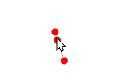

# network-chart

`<network-chart>` renders a network chart (a force-directed layout) with nodes connected by links.

This is useful when creating force directed layouts like:

- [Software networks](https://gramener.com/software/)
- [Coder networks](https://gramener.com/codersearch/)

## Usage

Add this code anywhere in your HTML page:

```html
<script src="https://cdn.jsdelivr.net/npm/uifactory@1.21.0/dist/uifactory.min.js" import="@network-chart"></script>
<script>
  /* exported nodes, links */
  var nodes = [
    { id: 0 },
    { id: 1 },
    { id: 2 },
    { id: 3 },
  ]
  var links = [
    { source: 0, target: 1 },
    { source: 1, target: 2 },
    { source: 2, target: 0 },
    { source: 0, target: 3 },
  ]
</script>
<network-chart data:js="{nodes: nodes, links: links}">
  Loading network...
</network-chart>
```

This renders the following output:



## Properties

`<network-chart>` has the following properties:

- `type`: string. "node-link"
- `data`: js="{}"
- `width`: number (optional). Chart width in pixels. Default: 500
- `height`: number (optional). Chart height in pixels. Default: 500
- `collide`: boolean (optional). If true, don't allow nodes to overlap. If set to a number, provide a padding between nodes. Default: false
- `drag-action`: string (optional). Default: pin
- `node`: boolean (optional). Show nodes? `node="false"` hides all nodes. Default: true
- `node-charge`: number (optional). How strongly nodes push each other. -ve values make nodes pull each other. Default: +30
- `link`: boolean (optional). Show links? `links="false"` hides all links. Default: true
- `link-id`: string (optional). TODO: document this. Default: None
- `label`: boolean (optional). Show labels? `labels="false"` hides all labels. Default: true

It also has properties that change the properties of nodes, links and labels:

- `node-size`: number (optional). Radius of node circles in pixels. Default: 5
- `node-fill`: color (optional). Color of the node circles. Default: red
- `node-opacity`: number (optional). Use 0.0 for transparent nodes, 1.0 for opaque nodes. Default: 1
- `node-stroke`: color (optional). Outline color of the node circles. Default: #fff
- `node-stroke-width`: number (optional). Thickness of the node circles in pixels. Default: 1
- `link-stroke`: color (optional). Line color of the links. Default: #999
- `link-stroke-width`: number (optional). Thickness of the links in pixels. Default: 1
- `link-opacity`: number (optional). Use 0.0 for transparent links, 1.0 for opaque links. Default: 0.6
- `link-distance`: number (optional). Default distance between nodes. Default: 30
- `label-text`: string (optional). Text to show in label. Default: None
- `label-text-anchor`: string (optional). `start` for left aligned, `end` for right-aligned, `middle` for centered. Default: middle
- `label-dominant-baseline`: string (optional). `hanging` for top aligned, `alphabetic` for bottom-aligned,  `middle` for centered. Default: middle
- `label-font-family`: string (optional). Label font name, e.g. `Roboto`. Default: sans-serif
- `label-font-size`: number (optional). Label font size in pixels. Default: 12
- `label-font-weight`: string (optional). Label font weight, e.g. "bold" or "". Default: bold
- `label-fill`: color (optional). Label font color. Default: black
- `label-dx`: number (optional). Shift label right in pixels. -ve values to shift left. Default: 0
- `label-dy`: number (optional). Shift label down in pixels. -ve values to shift up. Default: 0

These node/link/label properties can be functions that accept the node/link/node data object. For example:

- `node-fill:js="d => d.age < 18 ? 'red' : 'green'"` fills nodes red if `.age` is under 18, else green
- `link-opacity:js="d => d.count > 4 ? 1 : 0"` makes links with `.count` under 4 transparent, rest are shown

Changing any property re-renders the component. For example:

```js
// Re-render the network with green nodes
document.querySelector('network-chart').nodeFill = 'green'
```

## Examples

<script src="../src/uifactory.js" import="@network-chart"></script>
<script>
  /* exported nodes, links */
  var book = {
    nodes: [{"id":"Myriel","group":1},{"id":"Napoleon","group":1},{"id":"Mlle.Baptistine","group":1},{"id":"Mme.Magloire","group":1},{"id":"CountessdeLo","group":1},{"id":"Geborand","group":1},{"id":"Champtercier","group":1},{"id":"Cravatte","group":1},{"id":"Count","group":1},{"id":"OldMan","group":1},{"id":"Labarre","group":2},{"id":"Valjean","group":2},{"id":"Marguerite","group":3},{"id":"Mme.deR","group":2},{"id":"Isabeau","group":2},{"id":"Gervais","group":2},{"id":"Tholomyes","group":3},{"id":"Listolier","group":3},{"id":"Fameuil","group":3},{"id":"Blacheville","group":3},{"id":"Favourite","group":3},{"id":"Dahlia","group":3},{"id":"Zephine","group":3},{"id":"Fantine","group":3},{"id":"Mme.Thenardier","group":4},{"id":"Thenardier","group":4},{"id":"Cosette","group":5},{"id":"Javert","group":4},{"id":"Fauchelevent","group":0},{"id":"Bamatabois","group":2},{"id":"Perpetue","group":3},{"id":"Simplice","group":2},{"id":"Scaufflaire","group":2},{"id":"Woman1","group":2},{"id":"Judge","group":2},{"id":"Champmathieu","group":2},{"id":"Brevet","group":2},{"id":"Chenildieu","group":2},{"id":"Cochepaille","group":2},{"id":"Pontmercy","group":4},{"id":"Boulatruelle","group":6},{"id":"Eponine","group":4},{"id":"Anzelma","group":4},{"id":"Woman2","group":5},{"id":"MotherInnocent","group":0},{"id":"Gribier","group":0},{"id":"Jondrette","group":7},{"id":"Mme.Burgon","group":7},{"id":"Gavroche","group":8},{"id":"Gillenormand","group":5},{"id":"Magnon","group":5},{"id":"Mlle.Gillenormand","group":5},{"id":"Mme.Pontmercy","group":5},{"id":"Mlle.Vaubois","group":5},{"id":"Lt.Gillenormand","group":5},{"id":"Marius","group":8},{"id":"BaronessT","group":5},{"id":"Mabeuf","group":8},{"id":"Enjolras","group":8},{"id":"Combeferre","group":8},{"id":"Prouvaire","group":8},{"id":"Feuilly","group":8},{"id":"Courfeyrac","group":8},{"id":"Bahorel","group":8},{"id":"Bossuet","group":8},{"id":"Joly","group":8},{"id":"Grantaire","group":8},{"id":"MotherPlutarch","group":9},{"id":"Gueulemer","group":4},{"id":"Babet","group":4},{"id":"Claquesous","group":4},{"id":"Montparnasse","group":4},{"id":"Toussaint","group":5},{"id":"Child1","group":10},{"id":"Child2","group":10},{"id":"Brujon","group":4},{"id":"Mme.Hucheloup","group":8}],
    links: [{"source":"Napoleon","target":"Myriel","value":1},{"source":"Mlle.Baptistine","target":"Myriel","value":8},{"source":"Mme.Magloire","target":"Myriel","value":10},{"source":"Mme.Magloire","target":"Mlle.Baptistine","value":6},{"source":"CountessdeLo","target":"Myriel","value":1},{"source":"Geborand","target":"Myriel","value":1},{"source":"Champtercier","target":"Myriel","value":1},{"source":"Cravatte","target":"Myriel","value":1},{"source":"Count","target":"Myriel","value":2},{"source":"OldMan","target":"Myriel","value":1},{"source":"Valjean","target":"Labarre","value":1},{"source":"Valjean","target":"Mme.Magloire","value":3},{"source":"Valjean","target":"Mlle.Baptistine","value":3},{"source":"Valjean","target":"Myriel","value":5},{"source":"Marguerite","target":"Valjean","value":1},{"source":"Mme.deR","target":"Valjean","value":1},{"source":"Isabeau","target":"Valjean","value":1},{"source":"Gervais","target":"Valjean","value":1},{"source":"Listolier","target":"Tholomyes","value":4},{"source":"Fameuil","target":"Tholomyes","value":4},{"source":"Fameuil","target":"Listolier","value":4},{"source":"Blacheville","target":"Tholomyes","value":4},{"source":"Blacheville","target":"Listolier","value":4},{"source":"Blacheville","target":"Fameuil","value":4},{"source":"Favourite","target":"Tholomyes","value":3},{"source":"Favourite","target":"Listolier","value":3},{"source":"Favourite","target":"Fameuil","value":3},{"source":"Favourite","target":"Blacheville","value":4},{"source":"Dahlia","target":"Tholomyes","value":3},{"source":"Dahlia","target":"Listolier","value":3},{"source":"Dahlia","target":"Fameuil","value":3},{"source":"Dahlia","target":"Blacheville","value":3},{"source":"Dahlia","target":"Favourite","value":5},{"source":"Zephine","target":"Tholomyes","value":3},{"source":"Zephine","target":"Listolier","value":3},{"source":"Zephine","target":"Fameuil","value":3},{"source":"Zephine","target":"Blacheville","value":3},{"source":"Zephine","target":"Favourite","value":4},{"source":"Zephine","target":"Dahlia","value":4},{"source":"Fantine","target":"Tholomyes","value":3},{"source":"Fantine","target":"Listolier","value":3},{"source":"Fantine","target":"Fameuil","value":3},{"source":"Fantine","target":"Blacheville","value":3},{"source":"Fantine","target":"Favourite","value":4},{"source":"Fantine","target":"Dahlia","value":4},{"source":"Fantine","target":"Zephine","value":4},{"source":"Fantine","target":"Marguerite","value":2},{"source":"Fantine","target":"Valjean","value":9},{"source":"Mme.Thenardier","target":"Fantine","value":2},{"source":"Mme.Thenardier","target":"Valjean","value":7},{"source":"Thenardier","target":"Mme.Thenardier","value":13},{"source":"Thenardier","target":"Fantine","value":1},{"source":"Thenardier","target":"Valjean","value":12},{"source":"Cosette","target":"Mme.Thenardier","value":4},{"source":"Cosette","target":"Valjean","value":31},{"source":"Cosette","target":"Tholomyes","value":1},{"source":"Cosette","target":"Thenardier","value":1},{"source":"Javert","target":"Valjean","value":17},{"source":"Javert","target":"Fantine","value":5},{"source":"Javert","target":"Thenardier","value":5},{"source":"Javert","target":"Mme.Thenardier","value":1},{"source":"Javert","target":"Cosette","value":1},{"source":"Fauchelevent","target":"Valjean","value":8},{"source":"Fauchelevent","target":"Javert","value":1},{"source":"Bamatabois","target":"Fantine","value":1},{"source":"Bamatabois","target":"Javert","value":1},{"source":"Bamatabois","target":"Valjean","value":2},{"source":"Perpetue","target":"Fantine","value":1},{"source":"Simplice","target":"Perpetue","value":2},{"source":"Simplice","target":"Valjean","value":3},{"source":"Simplice","target":"Fantine","value":2},{"source":"Simplice","target":"Javert","value":1},{"source":"Scaufflaire","target":"Valjean","value":1},{"source":"Woman1","target":"Valjean","value":2},{"source":"Woman1","target":"Javert","value":1},{"source":"Judge","target":"Valjean","value":3},{"source":"Judge","target":"Bamatabois","value":2},{"source":"Champmathieu","target":"Valjean","value":3},{"source":"Champmathieu","target":"Judge","value":3},{"source":"Champmathieu","target":"Bamatabois","value":2},{"source":"Brevet","target":"Judge","value":2},{"source":"Brevet","target":"Champmathieu","value":2},{"source":"Brevet","target":"Valjean","value":2},{"source":"Brevet","target":"Bamatabois","value":1},{"source":"Chenildieu","target":"Judge","value":2},{"source":"Chenildieu","target":"Champmathieu","value":2},{"source":"Chenildieu","target":"Brevet","value":2},{"source":"Chenildieu","target":"Valjean","value":2},{"source":"Chenildieu","target":"Bamatabois","value":1},{"source":"Cochepaille","target":"Judge","value":2},{"source":"Cochepaille","target":"Champmathieu","value":2},{"source":"Cochepaille","target":"Brevet","value":2},{"source":"Cochepaille","target":"Chenildieu","value":2},{"source":"Cochepaille","target":"Valjean","value":2},{"source":"Cochepaille","target":"Bamatabois","value":1},{"source":"Pontmercy","target":"Thenardier","value":1},{"source":"Boulatruelle","target":"Thenardier","value":1},{"source":"Eponine","target":"Mme.Thenardier","value":2},{"source":"Eponine","target":"Thenardier","value":3},{"source":"Anzelma","target":"Eponine","value":2},{"source":"Anzelma","target":"Thenardier","value":2},{"source":"Anzelma","target":"Mme.Thenardier","value":1},{"source":"Woman2","target":"Valjean","value":3},{"source":"Woman2","target":"Cosette","value":1},{"source":"Woman2","target":"Javert","value":1},{"source":"MotherInnocent","target":"Fauchelevent","value":3},{"source":"MotherInnocent","target":"Valjean","value":1},{"source":"Gribier","target":"Fauchelevent","value":2},{"source":"Mme.Burgon","target":"Jondrette","value":1},{"source":"Gavroche","target":"Mme.Burgon","value":2},{"source":"Gavroche","target":"Thenardier","value":1},{"source":"Gavroche","target":"Javert","value":1},{"source":"Gavroche","target":"Valjean","value":1},{"source":"Gillenormand","target":"Cosette","value":3},{"source":"Gillenormand","target":"Valjean","value":2},{"source":"Magnon","target":"Gillenormand","value":1},{"source":"Magnon","target":"Mme.Thenardier","value":1},{"source":"Mlle.Gillenormand","target":"Gillenormand","value":9},{"source":"Mlle.Gillenormand","target":"Cosette","value":2},{"source":"Mlle.Gillenormand","target":"Valjean","value":2},{"source":"Mme.Pontmercy","target":"Mlle.Gillenormand","value":1},{"source":"Mme.Pontmercy","target":"Pontmercy","value":1},{"source":"Mlle.Vaubois","target":"Mlle.Gillenormand","value":1},{"source":"Lt.Gillenormand","target":"Mlle.Gillenormand","value":2},{"source":"Lt.Gillenormand","target":"Gillenormand","value":1},{"source":"Lt.Gillenormand","target":"Cosette","value":1},{"source":"Marius","target":"Mlle.Gillenormand","value":6},{"source":"Marius","target":"Gillenormand","value":12},{"source":"Marius","target":"Pontmercy","value":1},{"source":"Marius","target":"Lt.Gillenormand","value":1},{"source":"Marius","target":"Cosette","value":21},{"source":"Marius","target":"Valjean","value":19},{"source":"Marius","target":"Tholomyes","value":1},{"source":"Marius","target":"Thenardier","value":2},{"source":"Marius","target":"Eponine","value":5},{"source":"Marius","target":"Gavroche","value":4},{"source":"BaronessT","target":"Gillenormand","value":1},{"source":"BaronessT","target":"Marius","value":1},{"source":"Mabeuf","target":"Marius","value":1},{"source":"Mabeuf","target":"Eponine","value":1},{"source":"Mabeuf","target":"Gavroche","value":1},{"source":"Enjolras","target":"Marius","value":7},{"source":"Enjolras","target":"Gavroche","value":7},{"source":"Enjolras","target":"Javert","value":6},{"source":"Enjolras","target":"Mabeuf","value":1},{"source":"Enjolras","target":"Valjean","value":4},{"source":"Combeferre","target":"Enjolras","value":15},{"source":"Combeferre","target":"Marius","value":5},{"source":"Combeferre","target":"Gavroche","value":6},{"source":"Combeferre","target":"Mabeuf","value":2},{"source":"Prouvaire","target":"Gavroche","value":1},{"source":"Prouvaire","target":"Enjolras","value":4},{"source":"Prouvaire","target":"Combeferre","value":2},{"source":"Feuilly","target":"Gavroche","value":2},{"source":"Feuilly","target":"Enjolras","value":6},{"source":"Feuilly","target":"Prouvaire","value":2},{"source":"Feuilly","target":"Combeferre","value":5},{"source":"Feuilly","target":"Mabeuf","value":1},{"source":"Feuilly","target":"Marius","value":1},{"source":"Courfeyrac","target":"Marius","value":9},{"source":"Courfeyrac","target":"Enjolras","value":17},{"source":"Courfeyrac","target":"Combeferre","value":13},{"source":"Courfeyrac","target":"Gavroche","value":7},{"source":"Courfeyrac","target":"Mabeuf","value":2},{"source":"Courfeyrac","target":"Eponine","value":1},{"source":"Courfeyrac","target":"Feuilly","value":6},{"source":"Courfeyrac","target":"Prouvaire","value":3},{"source":"Bahorel","target":"Combeferre","value":5},{"source":"Bahorel","target":"Gavroche","value":5},{"source":"Bahorel","target":"Courfeyrac","value":6},{"source":"Bahorel","target":"Mabeuf","value":2},{"source":"Bahorel","target":"Enjolras","value":4},{"source":"Bahorel","target":"Feuilly","value":3},{"source":"Bahorel","target":"Prouvaire","value":2},{"source":"Bahorel","target":"Marius","value":1},{"source":"Bossuet","target":"Marius","value":5},{"source":"Bossuet","target":"Courfeyrac","value":12},{"source":"Bossuet","target":"Gavroche","value":5},{"source":"Bossuet","target":"Bahorel","value":4},{"source":"Bossuet","target":"Enjolras","value":10},{"source":"Bossuet","target":"Feuilly","value":6},{"source":"Bossuet","target":"Prouvaire","value":2},{"source":"Bossuet","target":"Combeferre","value":9},{"source":"Bossuet","target":"Mabeuf","value":1},{"source":"Bossuet","target":"Valjean","value":1},{"source":"Joly","target":"Bahorel","value":5},{"source":"Joly","target":"Bossuet","value":7},{"source":"Joly","target":"Gavroche","value":3},{"source":"Joly","target":"Courfeyrac","value":5},{"source":"Joly","target":"Enjolras","value":5},{"source":"Joly","target":"Feuilly","value":5},{"source":"Joly","target":"Prouvaire","value":2},{"source":"Joly","target":"Combeferre","value":5},{"source":"Joly","target":"Mabeuf","value":1},{"source":"Joly","target":"Marius","value":2},{"source":"Grantaire","target":"Bossuet","value":3},{"source":"Grantaire","target":"Enjolras","value":3},{"source":"Grantaire","target":"Combeferre","value":1},{"source":"Grantaire","target":"Courfeyrac","value":2},{"source":"Grantaire","target":"Joly","value":2},{"source":"Grantaire","target":"Gavroche","value":1},{"source":"Grantaire","target":"Bahorel","value":1},{"source":"Grantaire","target":"Feuilly","value":1},{"source":"Grantaire","target":"Prouvaire","value":1},{"source":"MotherPlutarch","target":"Mabeuf","value":3},{"source":"Gueulemer","target":"Thenardier","value":5},{"source":"Gueulemer","target":"Valjean","value":1},{"source":"Gueulemer","target":"Mme.Thenardier","value":1},{"source":"Gueulemer","target":"Javert","value":1},{"source":"Gueulemer","target":"Gavroche","value":1},{"source":"Gueulemer","target":"Eponine","value":1},{"source":"Babet","target":"Thenardier","value":6},{"source":"Babet","target":"Gueulemer","value":6},{"source":"Babet","target":"Valjean","value":1},{"source":"Babet","target":"Mme.Thenardier","value":1},{"source":"Babet","target":"Javert","value":2},{"source":"Babet","target":"Gavroche","value":1},{"source":"Babet","target":"Eponine","value":1},{"source":"Claquesous","target":"Thenardier","value":4},{"source":"Claquesous","target":"Babet","value":4},{"source":"Claquesous","target":"Gueulemer","value":4},{"source":"Claquesous","target":"Valjean","value":1},{"source":"Claquesous","target":"Mme.Thenardier","value":1},{"source":"Claquesous","target":"Javert","value":1},{"source":"Claquesous","target":"Eponine","value":1},{"source":"Claquesous","target":"Enjolras","value":1},{"source":"Montparnasse","target":"Javert","value":1},{"source":"Montparnasse","target":"Babet","value":2},{"source":"Montparnasse","target":"Gueulemer","value":2},{"source":"Montparnasse","target":"Claquesous","value":2},{"source":"Montparnasse","target":"Valjean","value":1},{"source":"Montparnasse","target":"Gavroche","value":1},{"source":"Montparnasse","target":"Eponine","value":1},{"source":"Montparnasse","target":"Thenardier","value":1},{"source":"Toussaint","target":"Cosette","value":2},{"source":"Toussaint","target":"Javert","value":1},{"source":"Toussaint","target":"Valjean","value":1},{"source":"Child1","target":"Gavroche","value":2},{"source":"Child2","target":"Gavroche","value":2},{"source":"Child2","target":"Child1","value":3},{"source":"Brujon","target":"Babet","value":3},{"source":"Brujon","target":"Gueulemer","value":3},{"source":"Brujon","target":"Thenardier","value":3},{"source":"Brujon","target":"Gavroche","value":1},{"source":"Brujon","target":"Eponine","value":1},{"source":"Brujon","target":"Claquesous","value":1},{"source":"Brujon","target":"Montparnasse","value":1},{"source":"Mme.Hucheloup","target":"Bossuet","value":1},{"source":"Mme.Hucheloup","target":"Joly","value":1},{"source":"Mme.Hucheloup","target":"Grantaire","value":1},{"source":"Mme.Hucheloup","target":"Bahorel","value":1},{"source":"Mme.Hucheloup","target":"Courfeyrac","value":1},{"source":"Mme.Hucheloup","target":"Gavroche","value":1},{"source":"Mme.Hucheloup","target":"Enjolras","value":1}]
  }
</script>
<style>
.pinned { stroke-width: 3px; stroke: black; }
</style>
<network-chart
    data:js="book"
    link-id="id"
    node-charge="-100"
    drag-action="pin"
    label-text:js="d => d.id"
    label-dy="d => d.group / 2 + 15"
    type="node-link"
    collide:number="10"
    node-size:js="d => d.group * 2"
    node-fill:js="d => d.group < 6 ? 'red' : 'orange'"
    node-stroke:js="d => d.group < 3 ? 'black' : 'white'"
    link-opacity="0.6">
  Loading network...
</network-chart>

<script src="https://cdn.jsdelivr.net/npm/uifactory@1.21.0/dist/uifactory.min.js" import="@network-chart"></script>
<script>
  /* exported nodes, links */
  var nodes = [
    { id: 0 },
    { id: 1 },
    { id: 2 },
    { id: 3 },
  ]
  var links = [
    { source: 0, target: 1 },
    { source: 1, target: 2 },
    { source: 2, target: 0 },
    { source: 0, target: 3 },
  ]
</script>
<network-chart data:js="{nodes: nodes, links: links}">
  Loading network...
</network-chart>
