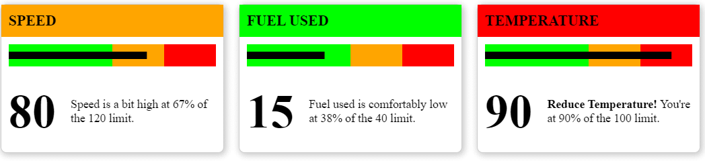
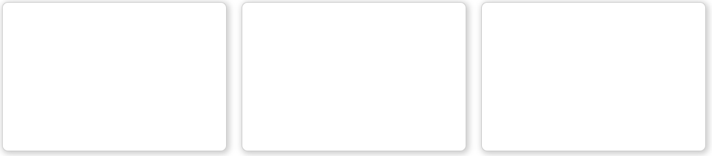
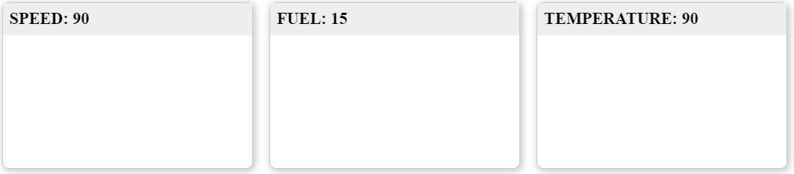
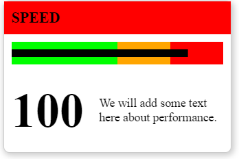
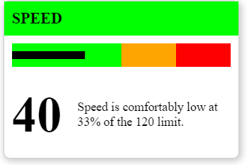

# UIFactory Quickstart

This is a 15-minute tutorial on building web components with UIFactory. You'll learn how to:

1. Create custom web components with just HTML, CSS and JS
2. Make these components re-usable and distribute them
3. Integrate them in any framework like Angular, React, or Vue

We'll build a simple dashboard showing KPI cards that looks like this:



## 1. Create a CodePen

[Create a CodePen](https://codepen.io/pen/?editors=1000) by visiting `https://codepen.io/pen/`. Name it `kpi-card`.

## 2. Include UIFactory

Add these 2 lines to the HTML. This links directly to UIFactory from CDNJS, and you don't need to install anything.

```html
<script src="https://cdn.jsdelivr.net/npm/uifactory@0.0.17/dist/uifactory.min.js"></script>
```

[See on CodePen](https://codepen.io/sanand0/pen/QWgaXmg?editors=1000)

## 3. Create a component with HTML and CSS

Anything inside `<template $name="kpi-card">...</template>` automatically becomes your `<kpi-card>` component. For example,

Create the outline of the KPI card by adding this HTML and CSS.

```html
<!-- Create the component with HTML and CSS -->
<template $name="kpi-card">
  <style>
    kpi-card main {
      width: 300px;
      height: 200px;
      border: 1px solid rgba(0,0,0,0.2);
      border-radius: 0.5rem;
      box-shadow: 2px 2px 8px 2px rgba(0,0,0,0.2);
      margin: 0.5rem;
      display: inline-block;
    }
  </style>

  <main></main>
</template>
```

This creates a `<kpi-card>` component. Every time you add it to the page, it adds a block.

```html
<!-- Use the component multiple times -->
<kpi-card></kpi-card>
<kpi-card></kpi-card>
<kpi-card></kpi-card>
```



[See on CodePen](https://codepen.io/sanand0/pen/ExXoBpG?editors=1000)

## 4. Customize components with attributes

To customize `<kpi-card>` with different titles, let's add the `title=` attribute to it. Replace this line:

```html
<template $name="kpi-card">
```

... with this:

```html
<template $name="kpi-card" title="Default title">
```

This `title` attribute is available as a JavaScript variable. Replace this line:

```html
  <main></main>
```

... with this:

```html
  <main>
    <h1>${title}</h1>
  </main>
```

Now, when you add a `title=` to each component, it adds a new title.

```html
<kpi-card title="Speed"></kpi-card>
<kpi-card title="Fuel"></kpi-card>
<kpi-card title="Temperature"></kpi-card>
```


[See on CodePen](https://codepen.io/sanand0/pen/powavGm?editors=1000)

Note: We added a little style to the heading using:

```css
    kpi-card h1 {
      margin: 0;
      padding: 0.5rem 0.5rem;
      font-size: 125%;
      text-transform: uppercase;
      background-color: #eee;
    }
```

## 5. Components can contain components

The entire dashboard can be converted into a web component for re-use across pages.

Create a `<kpi-dashboard>` component by adding this:

```html
<!-- Create the dashboard component -->
<template $name="kpi-dashboard">
  <kpi-card title="Speed"></kpi-card>
  <kpi-card title="Fuel"></kpi-card>
  <kpi-card title="Temperature"></kpi-card>
</template>
```

Now, use this component by adding:

```html
<kpi-dashboard></kpi-dashboard>
```

The result is identical:


[See on CodePen](https://codepen.io/sanand0/pen/yLXvNYL?editors=1000)


## 6. Pass data to components

To pass JavaScript objects via attributes, we use the `:js` type suffix for attributes.
For example, `status:js="{Speed: 30, Fuel: 20, Temperature: 80}"` makes `status` available as
a JavaScript object.

Replace the `<template $name="kpi-dashboard">...</template>` code with:

```html
<!-- Create the dashboard component -->
<template $name="kpi-dashboard" status:js="{Speed: 30, Fuel: 20, Temperature: 80}">
  <kpi-card title="Speed: ${status.Speed}"></kpi-card>
  <kpi-card title="Fuel: ${status.Fuel}"></kpi-card>
  <kpi-card title="Temperature: ${status.Temperature}"></kpi-card>
</template>
```

This shows the values of speed, fuel and temperature in the titles when you pass `status:js="..."`
to `<kpi-dashboard>`, like this:

```html
<kpi-dashboard status:js="{Speed: 90, Fuel: 15, Temperature: 90}"></kpi-dashboard>
```



[See on CodePen](https://codepen.io/sanand0/pen/wveyaKR?editors=1000)


## 7. Write templates

Apart from using `${}` to insert JavaScript variables, you can use
[templates](https://lodash.com/docs/4.17.15#template) to write any JavaScript code.

Replace the `<template $name="kpi-dashboard">...</template>` code with:

```html
<!-- Create the dashboard component -->
<template $name="kpi-dashboard" status:js="">
  <% for (let key in status) { %>
    <kpi-card title="${key}: ${status[key]}"></kpi-card>
  <% } %>
</template>
```

The result is identical. But instead of hard-coding speed, fuel & temperature, `<kpi-dashboard>`
can be used for any metrics.

[See on CodePen](https://codepen.io/sanand0/pen/NWgyGZa?editors=1000)

Note: You can add any JavaScript code inside `<% ... %>`.


## 8. Create charts

We can use templates and SVG to create charts. Let's re-design `<kpi-card>` to include a chart, a
value and some commentary, like this:



Here's the code for this.

```html
<!-- Create the component with HTML and CSS -->
<template $name="kpi-card" title="Default title" value:number="50" limit:number="100">
  <style>
    /* We'll skip the styling here. Please see CodePen for the full style */
  </style>
  <main>
    <% let percent = value / limit * 100 %>
    <h1 class="${ percent <= 50 ? 'ok' : percent <= 75 ? 'warning' : 'danger' }">${title}</h1>
    <svg width="280" height="30" style="margin: 10px">
      <rect x="0" y="0" fill="red" width="100%" height="30"></rect>
      <rect x="0" y="0" fill="orange" width="75%" height="30"></rect>
      <rect x="0" y="0" fill="lime" width="50%" height="30"></rect>
      <rect x="0" y="10" fill="#000" width="<%= percent %>%" height="10"></rect>
    </svg>
    <section>
      <h2>${value}</h2>
      <p>We will add some text here about performance.</p>
    </section>
  </main>
</template>
```

Let's break this down, step-by-step:

1. `<template $name="kpi-card" title="Default title" value:number="50" limit:number="100">`
   lets us pass 3 attributes: title, value and limit. These 3 variables are available
2. `<% let percent = value / limit * 100 %>` calculates the value as a percentage of limit. If
   value = 300 and limit = 1000, percent = 30.
3. `<h1 class="${ percent <= 50 ? 'ok' : percent <= 75 ? 'warning' : 'danger' }">${title}</h1>`
   - If percent < 50, add a green `class="ok"` to the heading.
   - If percent < 75, add an orange `class="warning"` to the heading.
   - Else, add a red `class="danger"` to the heading.
4. We then add an SVG that has the outline of a bullet chart: 
5. `<rect x="0" y="10" fill="#000" width="<%= percent %>%" height="10"></rect>` draws a thick black line of width `percent`% 
6. `<h2>${value}</h2>` adds the `value` prominently below the chart

Now, we can create a full card with a title, value, chart and limit.

```html
<kpi-card title="Speed" value="100" limit="120"></kpi-card>
```


[See on CodePen](https://codepen.io/sanand0/pen/bGRLdXd?editors=1000)


## 9. Add narratives

Let's add some commentary around the value.

1. If it's under 50%, we'll say "Speed is comfortably low at xx% of the 120 limit."
2. If it's under 75%, we'll say "Speed is a bit high at xx% of the 120 limit."
3. Otherwise, we'll say "**Reduce Speed!** You're at xx% of the 120 limit."

To create this, change the `<p>We will add some text here about performance.</p>` to:

```html
      <p>
        <% if (percent < 50) { %>
          ${title} is comfortably low at ${Math.round(percent)}% of the ${limit} limit.
        <% } else if (percent < 75) { %>
          ${title} is a bit high at ${Math.round(percent)}% of the ${limit} limit.
        <% } else { %>
          <strong>Reduce ${title}!</strong> You're at ${Math.round(percent)}% of the ${limit} limit.
        <% } %>
      </p>
```



[See on CodePen](https://codepen.io/sanand0/pen/xxrYwJM?editors=1000)


## 10. Put it together in the dashboard

Now, let's re-write the dashboad component to be able to accept the status like this:

```html
<kpi-dashboard status:js="{Speed: [80, 120], 'Fuel used': [15, 40], Temperature: [90, 100]}"></kpi-dashboard>
```

To do that, we rewrite the component to loop through the keys in `status` and pass the title, limit
and value attributes:

```html
<!-- Create the dashboard component -->
<template $name="kpi-dashboard" status:js="">
  <% for (let key in status) { %>
    <kpi-card title="${key}" value="${status[key][0]}" limit="${status[key][1]}"></kpi-card>
  <% } %>
</template>
```


[See on CodePen](https://codepen.io/sanand0/pen/GREQoKj?editors=1000)


## 11. Distribute components as files

These web components can be stored in a HTML file. The filename is the same as component name, by
convention. This component is saved at [`kpi-dashboard.html`](kpi-dashboard.html).

To use it in your application, add:

```html
<script src="https://cdn.jsdelivr.net/npm/uifactory@0.0.17/dist/uifactory.min.js" import="kpi-dashboard.html"></script>
```

Note the `import="kpi-dashboard.html"` in the 2nd line. That makes `<kpi-dashboard>` available to
use in your page.

## 12. Use it with Angular or React or Vue

Frameworks like Angular, React or Vue focus on building applications.

UIFactory focuses on building components that can be used in applications.

UIFactory creates web components (also called custom elements) that work will with all web frameworks.

- [Angular works well with web components with CUSTOM_ELEMENTS_SCHEMA enabled](https://angular.io/api/core/CUSTOM_ELEMENTS_SCHEMA)
- [React works well with web components](https://reactjs.org/docs/web-components.html)
- [Vue works well with web components](https://v3.vuejs.org/guide/web-components.html)

Here's an example of using `<kpi-dashboard>` with React.

```jsx
ReactDOM.render(
  <section>
    <h1>KPI Dashboard</h1>
    <kpi-dashboard status="{Speed: [80, 120], 'Fuel used': [15, 40], Temperature: [90, 100]}"></kpi-dashboard>
  </section>,
  document.getElementById('root')
);
```

[See on CodePen](https://codepen.io/sanand0/pen/ExXQrXg?editors=1010)
