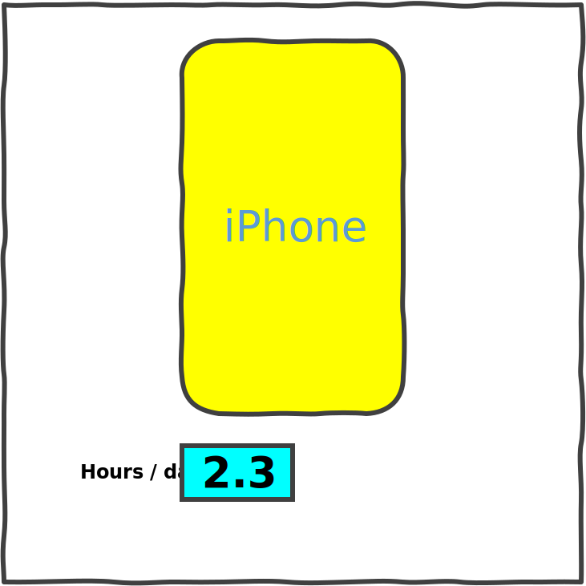

# svg-chart

`<svg-chart>` renders an SVG, modifying parts of it based on data using rules.

This is useful when creating:

- Data-driven infographics like [data portraits](https://gramener.com/gramex/guide/workshop/data-portraits/)
- [Coloring maps using data](https://gramener.com/cartogram/)
- Coloring physical layouts like
  - [manufacturing plants](https://gramener.com/processmonitor/monitor)
  - [store layouts](https://gramener.com/store/retail_store_layout)
- Coloring logical workflows like
  - [supply chains](https://gramener.com/store/retail_supply_chain)
  - [process workflows](https://gramener.com/servicerequests/)

## Usage

Add this code anywhere in your HTML page:

```html
<script src="https://cdn.jsdelivr.net/npm/uifactory@1.19.0/dist/uifactory.min.js" import="@svg-chart"></script>

<svg-chart src:urltext="https://cdn.glitch.com/00ca098e-1db3-4b35-aa48-6155f65df538%2Fphone.svg?v=1623937023597"
     data:js="{ phone: 'iPhone', hours: 2.3 }"
     rules:js="{
       '.phone': { fill: data.phone == 'Android' ? 'pink' : 'yellow' },
       '.phone-name': { text: data.phone },
       '.hours': { width: data.hours * 60, fill: 'aqua' },
       '.hours-text': { text: data.hours }
     }"></svg-chart>
</svg-chart>
```

This renders the following output:

{.img-fluid}

## Properties

`<svg-chart>` has 3 properties:

- `src`: [urltext](type-urltext.md) (**required**). The SVG file or URL to render. For example:
  - `src="https://example.org/your.svg"` renders the SVG -- provided
    [CORS](https://developer.mozilla.org/en-US/docs/Web/HTTP/CORS) is enabled.
  - `src:string="<svg><rect width='300' height='200' fill='red'></rect></svg>"` treats the
    attribute value as a string (instead of a URL) and renders it as SVG.
  - `src:js="myGlobalSvgString"` renders the SVG in the JavaScript global variable `myGlobalSvgString`
- `rules`: [urljson](type-urljson.md) (optional). The [JSON rules](#rules) to map data to SVG attributes. For example:
  - `rules="https://example.org/rules.json"` applies rules from the JSON file -- if
    [CORS](https://developer.mozilla.org/en-US/docs/Web/HTTP/CORS) is enabled.
  - `rules:js="'.phone': { fill: data.phone == 'Android' ? 'pink' : 'yellow' }` defines a rule inline as a JavaScript object
- `data`: [urljson](type-urljson.md) (optional). The data to modify the SVG file.
  - `data="https://example.org/data.json"` loads data from the JSON file -- if
    [CORS](https://developer.mozilla.org/en-US/docs/Web/HTTP/CORS) is enabled.
  - `data:js="{ phone: 'iPhone', hours: 2.3 }"` defines the data inline as a JavaScript object
    <!-- TODO: make data:js the default -->

Changing any property re-renders the component. For example:

```js
// Re-render the component with new data
document.querySelector('svg-chart').data = { phone: 'Android', hours: 2.9}
// Re-render the component with a new SVG that has a tall blue rectangle
document.querySelector('svg-chart').src = "<svg><rect width='300' height='400' fill='blue'></rect></svg>"
```

## Rules

Here's an example rule:

```json
{
  ".phone": {
    "fill": "data.phone == 'Android' ? 'pink' : 'yellow'"
  }
}
```

Each rule has 3 parts:

1. A CSS **selector**, like `.phone`. It applies this rule only to SVG elements matching `class="phone"`
2. An **attribute**, like `fill`. It replaces the `fill=` attribute of the selected SVG elements
3. A JavaScript **expression**, like `data.phone == 'Android' ? 'pink' : 'yellow'`. It replaces the
   `fill=` attribute with the result of this expression.
   - You can use `data` as a variable. This is the same `data=` property you defined.
   - You can use any global variables, like `uifactory`

## Examples

TODO
